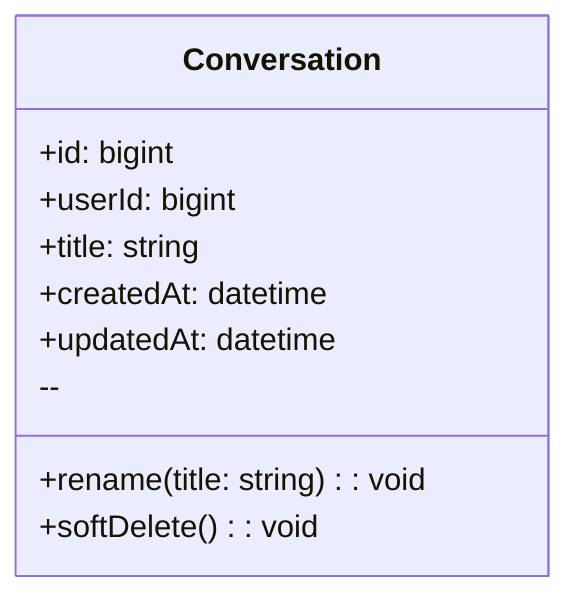
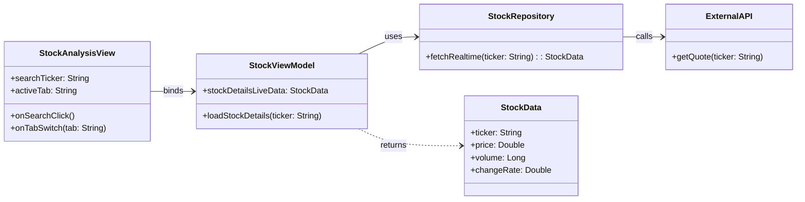
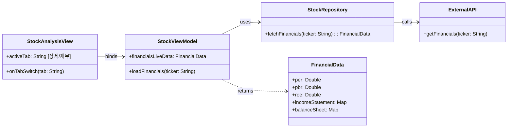
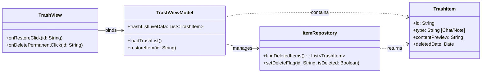

#예제 : classDiagram

## User
**Class Description**  
: 서비스 이용자 계정 및 식별 정보를 보관합니다.

### Attributes
- **id** *(bigint, public)*  
  : 사용자 PK.
- **username** *(string, public)*  
  : 로그인/표시용 사용자명(고유).
- **email** *(string, public)*  
  : 계정 이메일(로그인/알림 발송에 사용).
- **passwordHash** *(string, public)*  
  : 비밀번호 해시(평문 저장 금지).
- **createdAt** *(datetime, public)*  
  : 계정 생성 시각.
- **updatedAt** *(datetime, public)*  
  : 계정 정보 마지막 갱신 시각.

### Operations
- **register** *(username, email, password → User, public)*  
  : 신규 사용자 등록.
- **authenticate** *(usernameOrEmail, password → bool, public)*  
  : 인증 검사.
- **changePassword** *(oldPw, newPw → void, public)*  
  : 비밀번호 변경.
- **getSessions** *(→ Session[], public)*  
  : 사용자 세션 목록 조회.
- **getConversations** *(→ Conversation[], public)*  
  : 대화 목록 조회.

---
#1 종목 상세 정보 조회 : classDiagram

## StockAnalysisView
**Class Description**  
: 별도 분석 영역의 UI, 사용자 입력 및 탭 전환 이벤트를 수신합니다.

### Attributes
- **searchTicker** *(string, public)*  
  : 검색 입력 값.
- **activeTab** *(string, public)*  
  : 현재 활성화된 탭 (상세 정보).
- **email** *(string, public)*  
  : 계정 이메일(로그인/알림 발송에 사용).
- **passwordHash** *(string, public)*  
  : 비밀번호 해시(평문 저장 금지).
- **createdAt** *(datetime, public)*  
  : 계정 생성 시각.
- **updatedAt** *(datetime, public)*  
  : 계정 정보 마지막 갱신 시각.

### Operations
- **onSearchClick()** *(void, public)*  
  : 검색 버튼 클릭 처리.
- **onTabSwitch(tab: string)** *(void, public)*  
  : 탭 전환 이벤트 처리.

## StockViewModel
**Class Description**
: UI에 표시될 데이터 상태를 관리하고, View의 요청에 따라 데이터를 Repository에 요청합니다.

### Attributes
- **stockDetailsLiveData** *(StockData, public)*
  : 시세 데이터 상태.

### Operations
- **loadStockDetails(ticker: string)** *(void, public)*
  : 실시간 시세 로드 요청.
  
## StockRepository
**Class Description**
: 실시간 시세 및 재무 데이터를 외부 API로부터 효율적으로 가져와 데이터 모델로 변환합니다.

### Operations
- **fetchRealtime(ticker: string)** → **StockData (public)**
  : 실시간 데이터 조회 및 반환.
  
## ExternalAPI
**Class Description**
: 실제 증권사나 금융 데이터 제공업체의 API 호출을 담당하는 가상 클래스입니다.

## StockData
**Class Description**
: 특정 종목의 현재가, 거래량, 등락률 등 실시간 상세 시세 정보를 담는 데이터 구조입니다.

### Attributes
- **price** *(double, public)*
  : 현재 가격.
- **changeRate** *(double, public)*
  : 등락률.   
- **volume** *(long, public)*
  : 거래량.

---

#2 재무제표 조회 : classDiagram

## FinancialData
**Class Description**  
: 특정 종목의 재무 상태표, 손익계산서, 현금흐름표 및 PER, PBR, ROE 등 핵심 재무 지표를 담는 데이터 구조입니다.

### Attributes
- **per** *(double, public)*
  : 주가수익비율   
- **roe** *(double, public)*
  : 자기자본이익률   
- **incomeStatement** *(Map, public)*
  : 손익계산서 데이터

나머지 클래스 종목 상세 정보 조회와 동일
---

#3 휴지통 관리 : classDiagram

## TrashView
**Class Description**  
: 휴지통 목록을 출력하고, 항목 복원 또는 영구 삭제와 같은 사용자 입력을 처리합니다.

### Attributes
- **trashListDisplay** *(List, public)*
  : 화면에 표시되는 목록
  
### Operations
- **onRestoreClick(id: string)** *(void, public)*
  : 복원 버튼 클릭 처리
- **onDeletePermanentClick(id: string)** *(void, public)*
  : 영구 삭제 버튼 클릭 처리
  
## TrashViewModel
**Class Description**  
: 휴지통 목록의 상태를 관리하며, 사용자의 복원/삭제 요청에 따라 Repository에 데이터 변경합니다.

### Attributes
- **trashListLiveData** *(List, public)*
  : 휴지통 항목 상태

### Operations
- **loadTrashList()** *(void, public)*
  : 목록 조회 요청

## ItemRepository
**Class Description**  
: 로컬 DB에서 삭제 플래그가 설정된 항목을 조회하고, 사용자의 요청에 따라 플래그를 변경하거나 영구 삭제합니다.

### Operations
- **restoreItem(id: string)** *(void, public)*
  : 항목 복원 로직 실행
- **findDeletedItems()** → **TrashItem[] (public)**
  : 삭제 플래그 항목 조회
- **setDeleteFlag(id: string, isDeleted: bool)** *(public)*
  : 복원/삭제 플래그 변경

## TrashItem
**Class Description**  
: 삭제된 채팅 기록 또는 저장된 답변의 식별 정보, 유형, 내용 미리보기, 삭제 시각 등을 담는 데이터 구조입니다.
### Attributes
- **id** *(string, public)*
  : 항목 고유 ID   
- **deletedDate** *(datetime, public)*
  : 삭제된 시각   
- **contentPreview** *(string, public)*: 내용 미리보기

## LocalDB
**Class Description**  
: 실제 챗봇의 대화 기록 및 항목 저장 데이터를 보관하는 로컬 데이터베이스입니다.

---
