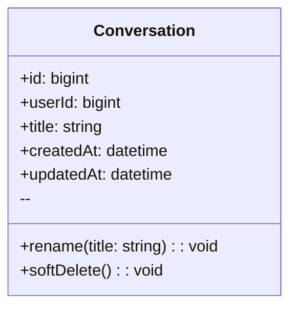
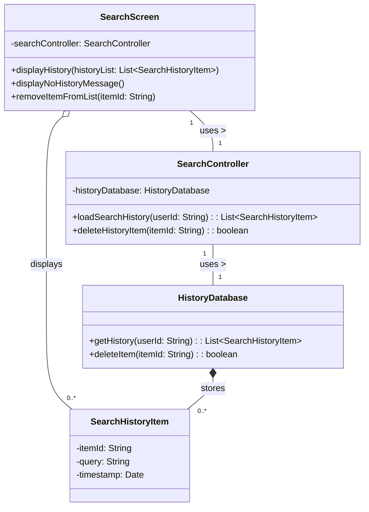

#예제 : classDiagram

## User
**Class Description**  
: 서비스 이용자 계정 및 식별 정보를 보관합니다.

### Attributes
- **id** *(bigint, public)*  
  : 사용자 PK.
- **username** *(string, public)*  
  : 로그인/표시용 사용자명(고유).
- **email** *(string, public)*  
  : 계정 이메일(로그인/알림 발송에 사용).
- **passwordHash** *(string, public)*  
  : 비밀번호 해시(평문 저장 금지).
- **createdAt** *(datetime, public)*  
  : 계정 생성 시각.
- **updatedAt** *(datetime, public)*  
  : 계정 정보 마지막 갱신 시각.

### Operations
- **register** *(username, email, password → User, public)*  
  : 신규 사용자 등록.
- **authenticate** *(usernameOrEmail, password → bool, public)*  
  : 인증 검사.
- **changePassword** *(oldPw, newPw → void, public)*  
  : 비밀번호 변경.
- **getSessions** *(→ Session[], public)*  
  : 사용자 세션 목록 조회.
- **getConversations** *(→ Conversation[], public)*  
  : 대화 목록 조회.

---

# 검색 기록: Class Diagram

## SearchScreen
**Class Description**  
: 사용자에게 검색 기록을 보여주고, 사용자 입력을 받아 SearchController에 전달하는 UI(표현) 계층이다.

### Attributes
- **searchController** *(SearchController, private)*  
  : 비즈니스 로직 처리를 요청하기 위한 컨트롤러 인스턴스.
- **currentHistoryList** *(List<SearchHistoryItem>, private)*  
  : 현재 화면에 표시되고 있는 검색 기록 목록.

### Operations
- **onSearchBoxClick** *(→ void, public)*  
  : 사용자가 검색창을 클릭했을 때의 이벤트 핸들러. (내부적으로 SearchController.loadSearchHistory 호출)
- **onDeleteItemClick** *(itemId: string → void, public)*  
  : 사용자가 특정 항목의 삭제 버튼을 클릭했을 때의 이벤트 핸들러. (내부적으로 SearchController.deleteHistoryItem 호출)
- **displayHistory** *(historyList: List<SearchHistoryItem> → void, public)*  
  : 컨트롤러로부터 받은 검색 기록 목록을 화면에 렌더링.
- **displayNoHistoryMessage** *(→ void, public)*  
  : 기록이 없을 경우 "검색 기록 없음" 메시지를 표시.
- **removeItemFromList** *(itemId: string → void, public)*  
  : currentHistoryList와 화면에서 특정 항목을 제거 (삭제 성공 시 호출됨).

## SearchController
**Class Description**  
: SearchScreen의 요청을 받아 비즈니스 로직을 수행하고, HistoryDatabase를 통해 데이터 작업을 지시하는 컨트롤러(로직) 계층이다.

### Attributes
- **historyDatabase** *(HistoryDatabase, private)*  
  : 데이터베이스 작업을 수행하기 위한 데이터 접근 객체.

### Operations
- **loadSearchHistory** *(userId: string → List<SearchHistoryItem>, public)*  
  : 사용자의 검색 기록을 HistoryDatabase에서 로드하여 반환.
- **deleteHistoryItem** *(itemId: string → boolean, public)*  
  : 특정 검색 기록 항목의 삭제를 HistoryDatabase에 요청하고 성공 여부를 반환.

## HistoryDatabase
**Class Description**  
: 검색 기록 데이터의 영속성(저장, 조회, 삭제)을 실제로 담당하는 데이터 접근(저장소) 계층이다.

### Attributes

### Operations
- **getHistory** *(userId: string → List<SearchHistoryItem>, public)*  
  : 데이터베이스에서 특정 사용자의 모든 검색 기록을 조회하여 반환.
- **deleteItem** *(itemId: string → boolean, public)*  
  : 데이터베이스에서 itemId와 일치하는 항목을 삭제하고 성공 여부를 반환.

## SearchHistoryItem
**Class Description**  
: 개별 검색 기록 항목을 나타내는 데이터 객체(DTO 또는 Entity)이다.

### Attributes
- **itemId** *(string, public)*  
  : 검색 기록 항목의 고유 식별자 (PK).
- **userId** *(bigint, public)*  
  : 해당 기록을 소유한 사용자의 ID (FK).
- **query** *(string, public)*  
  : 사용자가 입력했던 실제 검색어.
- **timestamp** *(datetime, public)*  
  : 해당 검색이 발생한 시각.

### Operations

---