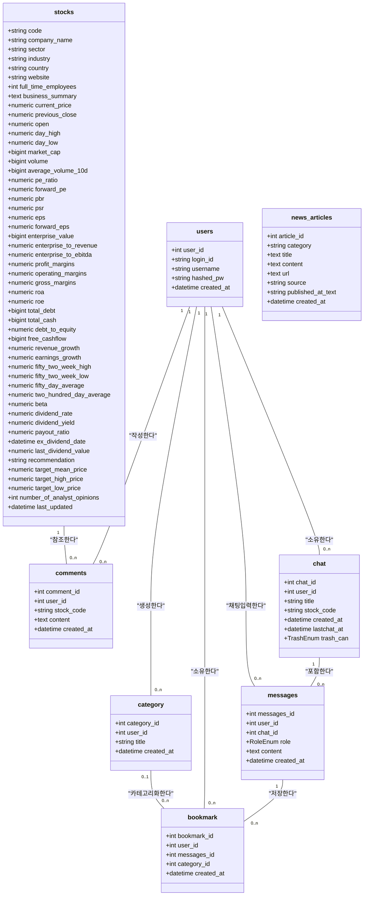
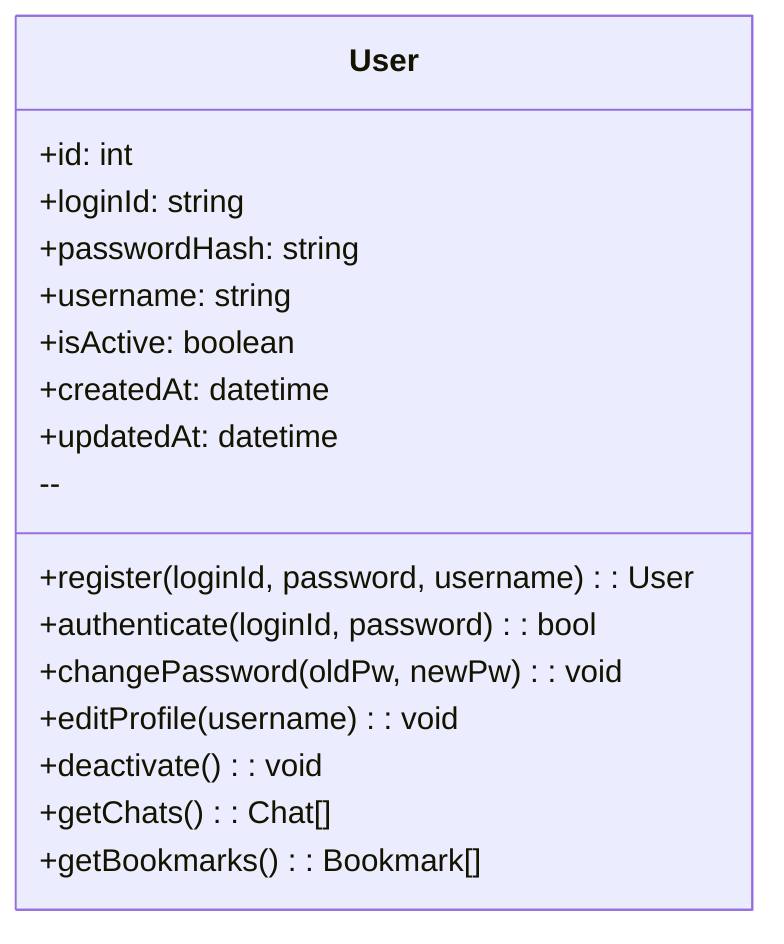
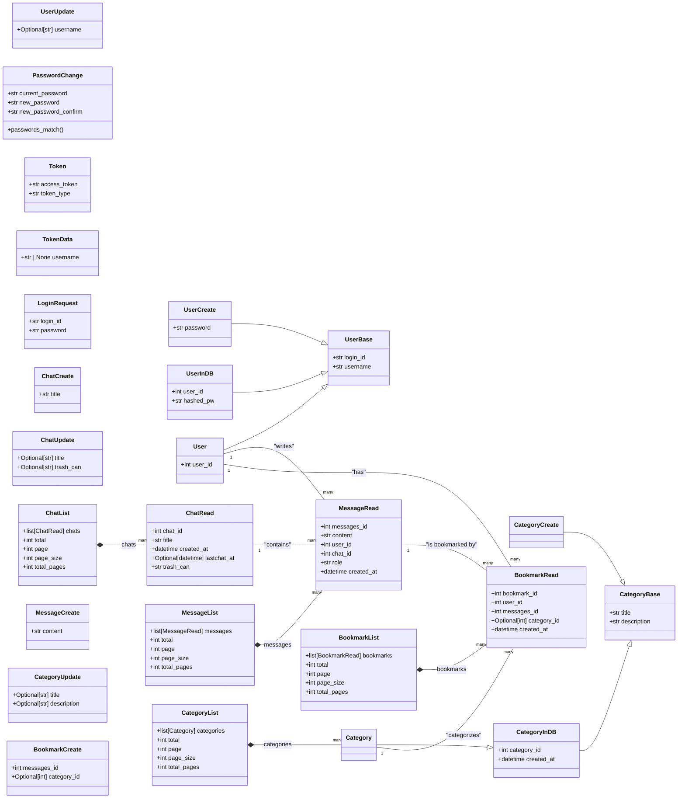
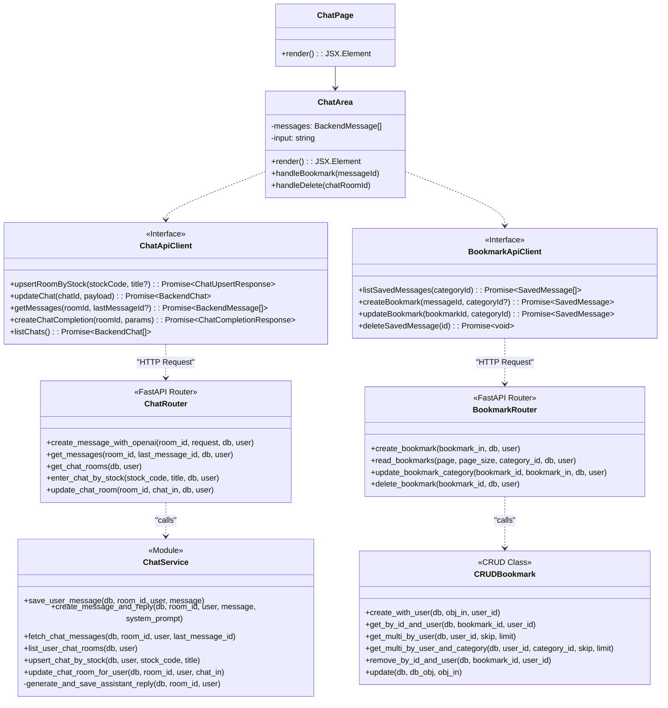
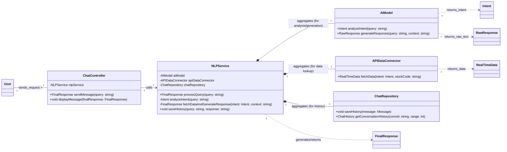
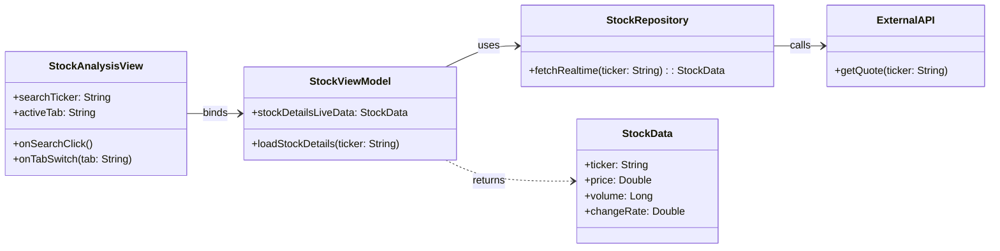
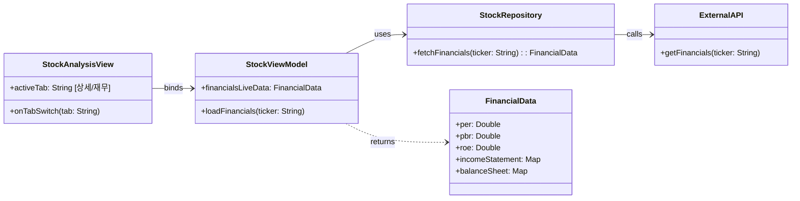
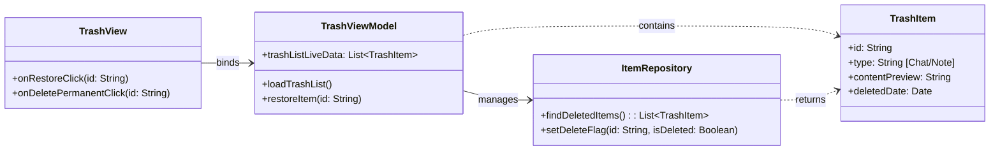

## 1. 클래스 다이어그램: User 채팅 및 북마크 관리

```mermaid
classDiagram
    class users {
        +int user_id
        +string login_id
        +string username
        +string hashed_pw
        +datetime created_at
    }
    class chat {
        +int chat_id
        +int user_id
        +string title
        +string stock_code
        +datetime created_at
        +datetime lastchat_at
        +TrashEnum trash_can
    }
    class messages {
        +int messages_id
        +int user_id
        +int chat_id
        +RoleEnum role
        +text content
        +datetime created_at
    }
    class category {
        +int category_id
        +int user_id
        +string title
        +datetime created_at
    }
    class bookmark {
        +int bookmark_id
        +int user_id
        +int messages_id
        +int category_id
        +datetime created_at
    }
    class stocks {
        +string code
        +string company_name
        +string sector
        +string industry
        +string country
        +string website
        +int full_time_employees
        +text business_summary
        +numeric current_price
        +numeric previous_close
        +numeric open
        +numeric day_high
        +numeric day_low
        +bigint market_cap
        +bigint volume
        +bigint average_volume_10d
        +numeric pe_ratio
        +numeric forward_pe
        +numeric pbr
        +numeric psr
        +numeric eps
        +numeric forward_eps
        +bigint enterprise_value
        +numeric enterprise_to_revenue
        +numeric enterprise_to_ebitda
        +numeric profit_margins
        +numeric operating_margins
        +numeric gross_margins
        +numeric roa
        +numeric roe
        +bigint total_debt
        +bigint total_cash
        +numeric debt_to_equity
        +bigint free_cashflow
        +numeric revenue_growth
        +numeric earnings_growth
        +numeric fifty_two_week_high
        +numeric fifty_two_week_low
        +numeric fifty_day_average
        +numeric two_hundred_day_average
        +numeric beta
        +numeric dividend_rate
        +numeric dividend_yield
        +numeric payout_ratio
        +datetime ex_dividend_date
        +numeric last_dividend_value
        +string recommendation
        +numeric target_mean_price
        +numeric target_high_price
        +numeric target_low_price
        +int number_of_analyst_opinions
        +datetime last_updated
    }

    class comments {
        +int comment_id
        +int user_id
        +string stock_code
        +text content
        +datetime created_at
    }
    class news_articles {
        +int article_id
        +string category
        +text title
        +text content
        +text url
        +string source
        +string published_at_text
        +datetime created_at
    }

    users "1" -- "0..n" chat : "소유한다"
    users "1" -- "0..n" messages : "채팅입력한다"
    users "1" -- "0..n" bookmark : "소유한다"
    users "1" -- "0..n" category : "생성한다"
    users "1" -- "0..n" comments : "작성한다"
    chat "1" -- "0..n" messages : "포함한다"
    messages "1" -- "0..n" bookmark : "저장한다"
    category "0..1" -- "0..n" bookmark : "카테고리화한다"

    stocks "1" -- "0..n" comments : "참조한다"
```
---

### 1.1 users
**Class Description**
: 서비스 이용자 계정 및 식별 정보를 보관합니다.

### Attributes
-   **user_id** *(int, public)*
    : 사용자 PK.
-   **login_id** *(string, public)*
    : 로그인 ID (고유).
-   **username** *(string, public)*
    : 사용자 표시명.
-   **hashed_pw** *(string, public)*
    : 해시 처리된 비밀번호.
-   **created_at** *(datetime, public)*
    : 계정 생성 시각.

---

### 1.2 chat
**Class Description**
: 사용자와 어시스턴트 간의 개별 대화(세션)를 정의합니다.

### Attributes
-   **chat_id** *(int, public)*
    : 채팅방 PK.
-   **user_id** *(int, public)*
    : 채팅방 소유자 (users.user_id FK).
-   **title** *(string, public)*
    : 채팅방 제목.
-   **created_at** *(datetime, public)*
    : 채팅방 생성 시각.
-   **lastchat_at** *(datetime, public)*
    : 마지막 메시지 전송 시각 (NULL 가능).
-   **trash_can** *(TrashEnum, public)*
    : 휴지통 상태 (in/out).

---

### 1.3 messages
**Class Description**
: 채팅방 내에서 사용자와 어시스턴트가 주고받은 개별 메시지를 저장합니다.

### Attributes
-   **messages_id** *(int, public)*
    : 메시지 PK.
-   **user_id** *(int, public)*
    : 메시지 작성자 (users.user_id FK).
-   **chat_id** *(int, public)*
    : 메시지가 속한 채팅방 (chat.chat_id FK).
-   **role** *(RoleEnum, public)*
    : 메시지 작성 주체 (user/assistant).
-   **content** *(text, public)*
    : 메시지 본문 내용.
-   **created_at** *(datetime, public)*
    : 메시지 생성 시각.

---

### 1.4 category
**Class Description**
: 북마크를 분류하기 위한 사용자 정의 카테고리입니다.

### Attributes
-   **category_id** *(int, public)*
    : 카테고리 PK.
-   **title** *(string, public)*
    : 카테고리 이름.
-   **created_at** *(datetime, public)*
    : 카테고리 생성 시각.

---

### 1.5 bookmark
**Class Description**
: 사용자가 특정 메시지(`messages`)를 저장(북마크)한 정보를 관리합니다. `users`와 `messages` 간의 연결 테이블 역할을 합니다.

### Attributes
-   **bookmark_id** *(int, public)*
    : 북마크 PK.
-   **user_id** *(int, public)*
    : 북마크 소유자 (users.user_id FK).
-   **messages_id** *(int, public)*
    : 북마크된 메시지 (messages.messages_id FK).
-   **category_id** *(int, public)*
    : 북마크가 속한 카테고리 (category.category_id FK, NULL 가능).
-   **created_at** *(datetime, public)*
    : 북마크 생성 시각.

---

### 1.6 stocks
**Class Description**
: 주식 종목의 기본 정보, 현재가, 밸류에이션 등 요약 정보를 저장합니다.

### Attributes
-   **code** *(string, public)*
    : 종목 코드 (PK).
-   **company_name** *(string, public)*
    : 회사명.
-   **sector** *(string, public)*
    : 섹터.
-   **industry** *(string, public)*
    : 산업군.
-   **country** *(string, public)*
    : 국가.
-   **website** *(string, public)*
    : 웹사이트.
-   **full_time_employees** *(int, public)*
    : 직원 수.
-   **business_summary** *(text, public)*
    : 비즈니스 요약.
-   **current_price** *(numeric, public)*
    : 현재 주가.
-   **previous_close** *(numeric, public)*
    : 전일 종가.
-   **open** *(numeric, public)*
    : 시가.
-   **day_high** *(numeric, public)*
    : 고가.
-   **day_low** *(numeric, public)*
    : 저가.
-   **market_cap** *(bigint, public)*
    : 시가 총액.
-   **volume** *(bigint, public)*
    : 거래량.
-   **average_volume_10d** *(bigint, public)*
    : 10일 평균 거래량.
-   **pe_ratio** *(numeric, public)*
    : 주가수익비율 (TTM).
-   **forward_pe** *(numeric, public)*
    : 선행 PER.
-   **pbr** *(numeric, public)*
    : 주가순자산비율.
-   **psr** *(numeric, public)*
    : 주가매출비율.
-   **eps** *(numeric, public)*
    : 주당순이익.
-   **forward_eps** *(numeric, public)*
    : 선행 EPS.
-   **enterprise_value** *(bigint, public)*
    : 기업 가치.
-   **enterprise_to_revenue** *(numeric, public)*
    : EV/Revenue.
-   **enterprise_to_ebitda** *(numeric, public)*
    : EV/EBITDA.
-   **profit_margins** *(numeric, public)*
    : 순이익률.
-   **operating_margins** *(numeric, public)*
    : 영업이익률.
-   **gross_margins** *(numeric, public)*
    : 매출총이익률.
-   **roa** *(numeric, public)*
    : 총자산이익률.
-   **roe** *(numeric, public)*
    : 자기자본이익률.
-   **total_debt** *(bigint, public)*
    : 총부채.
-   **total_cash** *(bigint, public)*
    : 총현금.
-   **debt_to_equity** *(numeric, public)*
    : 부채비율.
-   **free_cashflow** *(bigint, public)*
    : 잉여현금흐름.
-   **revenue_growth** *(numeric, public)*
    : 매출성장률.
-   **earnings_growth** *(numeric, public)*
    : 이익성장률.
-   **fifty_two_week_high** *(numeric, public)*
    : 52주 신고가.
-   **fifty_two_week_low** *(numeric, public)*
    : 52주 신저가.
-   **fifty_day_average** *(numeric, public)*
    : 50일 이동평균.
-   **two_hundred_day_average** *(numeric, public)*
    : 200일 이동평균.
-   **beta** *(numeric, public)*
    : 베타 (변동성 지표).
-   **dividend_rate** *(numeric, public)*
    : 배당금.
-   **dividend_yield** *(numeric, public)*
    : 배당 수익률.
-   **payout_ratio** *(numeric, public)*
    : 배당성향.
-   **ex_dividend_date** *(datetime, public)*
    : 배당락일.
-   **last_dividend_value** *(numeric, public)*
    : 마지막 배당금.
-   **recommendation** *(string, public)*
    : 애널리스트 투자의견.
-   **target_mean_price** *(numeric, public)*
    : 목표 주가 평균.
-   **target_high_price** *(numeric, public)*
    : 목표 주가 최고.
-   **target_low_price** *(numeric, public)*
    : 목표 주가 최저.
-   **number_of_analyst_opinions** *(int, public)*
    : 애널리스트 의견 수.
-   **last_updated** *(datetime, public)*
    : 정보 마지막 갱신 시각.

---

(Removed financial_statements)

### 1.8 comments
**Class Description**
: 종목 토론방 등에 작성된 사용자의 댓글을 저장합니다.

### Attributes
-   **comment_id** *(int, public)*
    : 댓글 PK.
-   **user_id** *(int, public)*
    : 작성자 ID (users.user_id FK).
-   **stock_code** *(string, public)*
    : 관련 종목 코드 (stocks.code FK).
-   **content** *(text, public)*
    : 댓글 내용.
-   **created_at** *(datetime, public)*
    : 생성 시각.

---

### 1.9 news_articles
**Class Description**
: 크롤링 및 수집된 뉴스/공시 데이터를 저장합니다.

### Attributes
-   **article_id** *(int, public)*
    : 뉴스 기사 PK.
-   **category** *(string, public)*
    : 뉴스 카테고리.
-   **title** *(text, public)*
    : 기사 제목.
-   **content** *(text, public)*
    : 기사 본문.
-   **url** *(text, public)*
    : 기사 원문 URL (Unique).
-   **source** *(string, public)*
    : 출처 (기본값: NAVER_FINANCE).
-   **published_at_text** *(string, public)*
    : 기사 발행 시각 (텍스트).
-   **created_at** *(datetime, public)*
    : 수집 시각.

---

## 2. 클래스 다이어그램: User 정보 및 로그인

```mermaid
classDiagram
  class User {
    +id: int
    +loginId: string
    +passwordHash: string
    +username: string
    +isActive: boolean
    +createdAt: datetime
    +updatedAt: datetime
    --
    +register(loginId, password, username): User
    +authenticate(loginId, password): bool
    +changePassword(oldPw, newPw): void
    +editProfile(username): void
    +deactivate(): void
    +getChats(): Chat[]
    +getBookmarks(): Bookmark[]
  }
```
---

### 2.1 User
**Class Description**  
: 이용자의 계정 정보와 핵심 데이터를 관리합니다.

### Attributes
- **id** *(int, public)*  
  : 사용자의 고유 식별자(PK).
- **loginId** *(string, public)*  
  : 로그인 시 사용하는 아이디(고유).
- **passwordHash** *(string, public)*  
  : 해시 처리된 비밀번호.
- **username** *(string, public)*  
  : 서비스 내에서 표시될 사용자명.
- **isActive** *(boolean, public)*  
  : 계정 활성화 여부.
- **createdAt** *(datetime, public)*  
  : 계정 생성 시각.
- **updatedAt** *(datetime, public)*  
  : 계정 정보 마지막 갱신 시각.

### Operations
- **register** *(loginId, password, username → User, public)*  
  : 신규 계정을 생성합니다.
- **authenticate** *(loginId, password → bool, public)*  
  : 로그인 정보를 검증합니다.
- **changePassword** *(oldPw, newPw → void, public)*  
  : 비밀번호를 변경합니다.
- **editProfile** *(username → void, public)*  
  : 사용자 프로필(이름)을 수정합니다.
- **deactivate** *(→ void, public)*  
  : 사용자 계정을 비활성화합니다.
- **getChats** *(→ Chat[], public)*  
  : 사용자의 모든 채팅 목록을 조회합니다.
- **getBookmarks** *(→ Bookmark[], public)*  
  : 사용자의 모든 북마크 목록을 조회합니다.

---

## 3. 데이터 타입: Class Diagram

```mermaid
classDiagram
    direction LR

    %% --- User & Auth Schemas ---
    class UserBase {
        +str login_id
        +str username
    }
    class UserCreate {
        +str password
    }
    UserCreate --|> UserBase
    class UserUpdate {
        +Optional[str] username
    }
    class PasswordChange {
        +str current_password
        +str new_password
        +str new_password_confirm
        +passwords_match()
    }
    class UserInDB {
        +int user_id
        +str hashed_pw
    }
    UserInDB --|> UserBase
    class User {
        +int user_id
    }
    User --|> UserBase

    class Token {
        +str access_token
        +str token_type
    }
    class TokenData {
        +str | None username
    }
    class LoginRequest {
        +str login_id
        +str password
    }

    %% --- Chat & Message Schemas ---
    class ChatCreate {
        +str title
    }
    class ChatUpdate {
        +Optional[str] title
        +Optional[str] trash_can
    }
    class ChatRead {
        +int chat_id
        +str title
        +datetime created_at
        +Optional[datetime] lastchat_at
        +str trash_can
    }
    class ChatList {
        +list[ChatRead] chats
        +int total
        +int page
        +int page_size
        +int total_pages
    }
    ChatList *-- "many" ChatRead : chats

    class MessageCreate {
        +str content
    }
    class MessageRead {
        +int messages_id
        +str content
        +int user_id
        +int chat_id
        +str role
        +datetime created_at
    }
    class MessageList {
        +list[MessageRead] messages
        +int total
        +int page
        +int page_size
        +int total_pages
    }
    MessageList *-- "many" MessageRead : messages

    %% --- Category Schemas ---
    class CategoryBase {
        +str title
        +str description
    }
    class CategoryCreate {
    }
    CategoryCreate --|> CategoryBase
    class CategoryUpdate {
        +Optional[str] title
        +Optional[str] description
    }
    class CategoryInDB {
        +int category_id
        +datetime created_at
    }
    CategoryInDB --|> CategoryBase
    class Category {
    }
    Category --|> CategoryInDB
    class CategoryList {
        +list[Category] categories
        +int total
        +int page
        +int page_size
        +int total_pages
    }
    CategoryList *-- "many" Category : categories

    %% --- Bookmark Schemas ---
    class BookmarkCreate {
        +int messages_id
        +Optional[int] category_id
    }
    class BookmarkRead {
        +int bookmark_id
        +int user_id
        +int messages_id
        +Optional[int] category_id
        +datetime created_at
    }
    class BookmarkList {
        +list[BookmarkRead] bookmarks
        +int total
        +int page
        +int page_size
        +int total_pages
    }
    BookmarkList *-- "many" BookmarkRead : bookmarks

    %% --- Relationships based on IDs ---
    User "1" -- "many" MessageRead : "writes"
    User "1" -- "many" BookmarkRead : "has"
    ChatRead "1" -- "many" MessageRead : "contains"
    MessageRead "1" -- "many" BookmarkRead : "is bookmarked by"
    Category "1" -- "many" BookmarkRead : "categorizes"
```
---

### 3.1 UserBase
**Class Description** : 사용자의 기본 공통 속성을 위한 Base 스키마입니다.

**Attributes**
* **login_id** *(str)*: 로그인 아이디 (min 4, max 50).
* **username** *(str)*: 사용자 이름 (min 2, max 50).

---

### 3.2 UserCreate
**Class Description** : 회원가입 시 요청에 사용할 스키마입니다. (UserBase 상속)

**Attributes**
* *(Inherited)* **login_id**, **username**
* **password** *(str)*: 비밀번호 (min 8).

---

### 3.3 UserUpdate
**Class Description** : 프로필 수정 시 요청에 사용할 스키마입니다.

**Attributes**
* **username** *(Optional[str])*: 사용자 이름 (min 2, max 50).

---

### 3.4 PasswordChange
**Class Description** : 비밀번호 변경 시 요청에 사용할 스키마입니다.

**Attributes**
* **current_password** *(str)*: 현재 비밀번호 (min 8).
* **new_password** *(str)*: 새 비밀번호 (min 8).
* **new_password_confirm** *(str)*: 새 비밀번호 확인 (min 8).

**Operations**
* **passwords_match** *(validator)*: `new_password`와 `new_password_confirm` 필드가 일치하는지 검증합니다.

---

### 3.5 UserInDB
**Class Description** : DB에서 읽어온 데이터를 위한 스키마 (내부 로직용). (UserBase 상속)

**Attributes**
* *(Inherited)* **login_id**, **username**
* **user_id** *(int)*: 사용자 고유 ID.
* **hashed_pw** *(str)*: 해시된 비밀번호.

---

### 3.6 User
**Class Description** : API 응답으로 클라이언트에게 반환할 스키마 (내 정보 조회). (UserBase 상속)

**Attributes**
* *(Inherited)* **login_id**, **username**
* **user_id** *(int)*: 사용자 고유 ID.

---

### 3.7 Token
**Class Description** : 로그인 성공 시 반환되는 JWT 토큰 응답 스키마입니다.

**Attributes**
* **access_token** *(str)*: 접근 토큰.
* **token_type** *(str)*: 토큰 타입 (예: "bearer").

---

### 3.8 TokenData
**Class Description** : JWT 토큰 내부에 저장되는 데이터 스키마입니다.

**Attributes**
* **username** *(Optional[str])*: 사용자 이름.

---

### 3.9 LoginRequest
**Class Description** : JSON 기반 로그인 요청 스키마 (OAuth2PasswordRequestForm 대안 옵션).

**Attributes**
* **login_id** *(str)*: 로그인 아이디 (min 4, max 50).
* **password** *(str)*: 비밀번호 (min 8).

---

### 3.10 ChatCreate
**Class Description** : 새 채팅방 생성을 위한 요청 스키마입니다.

**Attributes**
* **title** *(str)*: 채팅방 제목 (min 1, max 100).

---

### 3.11 ChatUpdate
**Class Description** : 채팅방 정보 수정을 위한 요청 스키마입니다.

**Attributes**
* **title** *(Optional[str])*: 새 채팅방 제목 (min 1, max 100).
* **trash_can** *(Optional[str])*: 휴지통 상태 (in 또는 out).

---

### 3.12 ChatRead
**Class Description** : 채팅방 정보 조회를 위한 응답 스키마입니다.

**Attributes**
* **chat_id** *(int)*: 채팅방 고유 ID.
* **title** *(str)*: 채팅방 제목.
* **stock_code** *(Optional[str])*: 종목 코드 (종목 채팅방인 경우).
* **created_at** *(datetime)*: 생성 시각.
* **lastchat_at** *(Optional[datetime])*: 마지막 대화 시각.
* **trash_can** *(str)*: 휴지통 상태.

---

### 3.13 ChatByStockResponse
**Class Description** : 종목 코드로 채팅방 조회/생성 시 반환되는 응답 스키마.

**Attributes**
* **chat_id** *(int)*: 채팅방 ID.
* **title** *(str)*: 채팅방 제목.
* **stock_code** *(str)*: 종목 코드.
* **existed** *(bool)*: 기존 채팅방 존재 여부.

---

### 3.14 ChatList
**Class Description** : 채팅방 목록 응답 스키마 (페이지네이션).

**Attributes**
* **chats** *(list[ChatRead])*: 채팅방 목록.
* **total** *(int)*: 전체 항목 수.
* **page** *(int)*: 현재 페이지 번호.
* **page_size** *(int)*: 페이지 당 항목 수.
* **total_pages** *(int)*: 전체 페이지 수.

---

### 3.15 MessageCreate
**Class Description** : 새 메시지 생성을 위한 요청 스키마 (POST /api/rooms/{room_id}/messages).

**Attributes**
* **content** *(str)*: 메시지 내용.

---

### 3.16 MessageRead
**Class Description** : 메시지 조회를 위한 응답 스키마 (GET /api/rooms/{room_id}/messages).

**Attributes**
* **messages_id** *(int)*: 메시지 고유 ID.
* **content** *(str)*: 메시지 내용.
* **user_id** *(int)*: 작성한 사용자 ID.
* **chat_id** *(int)*: 메시지가 속한 채팅방 ID.
* **role** *(str)*: 메시지 주체 (user 또는 assistant).
* **referenced_news** *(Optional[list[dict]])*: 참조된 뉴스 기사 목록.
* **created_at** *(datetime)*: 생성 시각.

---

### 3.17 MessageList
**Class Description** : 메시지 목록 응답 스키마 (페이지네이션).

**Attributes**
* **messages** *(list[MessageRead])*: 메시지 목록.
* **total** *(int)*: 전체 항목 수.
* **page** *(int)*: 현재 페이지 번호.
* **page_size** *(int)*: 페이지 당 항목 수.
* **total_pages** *(int)*: 전체 페이지 수.

---

### 3.18 CategoryBase
**Class Description** : 카테고리 공통 속성을 위한 기본 스키마입니다.

**Attributes**
* **title** *(str)*: 카테고리 제목 (max 50).
* **description** *(str)*: 카테고리 설명 (max 200).

---

### 3.19 CategoryCreate
**Class Description** : 카테고리 생성을 위한 요청 스키마입니다. (CategoryBase 상속)

**Attributes**
* *(Inherited)* **title**, **description**

---

### 3.20 CategoryUpdate
**Class Description** : 카테고리 수정을 위한 요청 스키마입니다.

**Attributes**
* **title** *(Optional[str])*: 카테고리 제목 (max 50).
* **description** *(Optional[str])*: 카테고리 설명 (max 200).

---

### 3.21 CategoryInDB
**Class Description** : 데이터베이스의 카테고리 스키마입니다. (CategoryBase 상속)

**Attributes**
* *(Inherited)* **title**, **description**
* **category_id** *(int)*: 카테고리 고유 ID.
* **created_at** *(datetime)*: 생성 시각.

---

### 3.22 Category
**Class Description** : 클라이언트에 카테고리 정보를 반환하기 위한 응답 스키마입니다. (CategoryInDB 상속)

**Attributes**
* *(Inherited)* **category_id**, **created_at**, **title**, **description**

---

### 3.23 CategoryList
**Class Description** : 카테고리 목록 응답 스키마 (페이지네이션).

**Attributes**
* **categories** *(list[Category])*: 카테고리 목록.
* **total** *(int)*: 전체 항목 수.
* **page** *(int)*: 현재 페이지 번호.
* **page_size** *(int)*: 페이지 당 항목 수.
* **total_pages** *(int)*: 전체 페이지 수.

---

### 3.24 BookmarkCreate
**Class Description** : 북마크(메시지 저장) 생성을 위한 요청 스키마입니다.

**Attributes**
* **messages_id** *(int)*: 저장할 메시지 ID.
* **category_id** *(Optional[int])*: 카테고리 ID (없으면 미분류).

---

### 3.25 BookmarkRead
**Class Description** : 북마크 조회를 위한 응답 스키마입니다.

**Attributes**
* **bookmark_id** *(int)*: 북마크 고유 ID.
* **user_id** *(int)*: 북마크한 사용자 ID.
* **messages_id** *(int)*: 저장된 메시지 ID.
* **category_id** *(Optional[int])*: 연결된 카테고리 ID.
* **created_at** *(datetime)*: 생성 시각.

---

### 3.26 BookmarkList
**Class Description** : 북마크 목록 응답 스키마 (페이지네이션).

**Attributes**
* **bookmarks** *(list[BookmarkRead])*: 북마크 목록.
* **total** *(int)*: 전체 항목 수.
* **page** *(int)*: 현재 페이지 번호.
* **page_size** *(int)*: 페이지 당 항목 수.
* **total_pages** *(int)*: 전체 페이지 수.

---

## 4. 채팅 메시지와 저장과 채팅방 삭제를 위한 class diagram

```mermaid
classDiagram
    %% --- Frontend Components ---
    class ChatApiClient {
      <<Interface>>
      +upsertRoomByStock(stockCode, title?): Promise~ChatUpsertResponse~
      +updateChat(chatId, payload): Promise~BackendChat~
      +getMessages(roomId, lastMessageId?): Promise~BackendMessage[]~
      +createChatCompletion(roomId, params): Promise~ChatCompletionResponse~
      +listChats(): Promise~BackendChat[]~
    }

    class BookmarkApiClient {
      <<Interface>>
      +listSavedMessages(categoryId): Promise~SavedMessage[]~
      +createBookmark(messageId, categoryId?): Promise~SavedMessage~
      +updateBookmark(bookmarkId, categoryId): Promise~SavedMessage~
      +deleteSavedMessage(id): Promise~void~
    }

    class ChatPage {
      +render(): JSX.Element
    }

    class ChatArea {
      -messages: BackendMessage[]
      -input: string
      +render(): JSX.Element
      +handleBookmark(messageId)
      +handleDelete(chatRoomId)
    }

    ChatPage --> ChatArea
    ChatArea ..> ChatApiClient
    ChatArea ..> BookmarkApiClient

    %% --- Backend Components ---
    
    class ChatRouter {
      <<FastAPI Router>>
      +create_message_with_openai(room_id, request, db, user)
      +get_messages(room_id, last_message_id, db, user)
      +get_chat_rooms(db, user)
      +enter_chat_by_stock(stock_code, title, db, user)
      +update_chat_room(room_id, chat_in, db, user)
    }

    class BookmarkRouter {
      <<FastAPI Router>>
      +create_bookmark(bookmark_in, db, user)
      +read_bookmarks(page, page_size, category_id, db, user)
      +update_bookmark_category(bookmark_id, bookmark_in, db, user)
      +delete_bookmark(bookmark_id, db, user)
    }

    class ChatService {
      <<Module>>
      +save_user_message(db, room_id, user, message)
      +create_message_and_reply(db, room_id, user, message, system_prompt)
      +fetch_chat_messages(db, room_id, user, last_message_id)
      +list_user_chat_rooms(db, user)
      +upsert_chat_by_stock(db, user, stock_code, title)
      +update_chat_room_for_user(db, room_id, user, chat_in)
      -generate_and_save_assistant_reply(db, room_id, user)
    }

    class CRUDBookmark {
      <<CRUD Class>>
      +create_with_user(db, obj_in, user_id)
      +get_by_id_and_user(db, bookmark_id, user_id)
      +get_multi_by_user(db, user_id, skip, limit)
      +get_multi_by_user_and_category(db, user_id, category_id, skip, limit)
      +remove_by_id_and_user(db, bookmark_id, user_id)
      +update(db, db_obj, obj_in)
    }

    %% --- Relationships ---
    ChatApiClient ..> ChatRouter : "HTTP Request"
    BookmarkApiClient ..> BookmarkRouter : "HTTP Request"

    ChatRouter ..> ChatService : "calls"
    BookmarkRouter ..> CRUDBookmark : "calls"
```
---

### 4.1 ChatApiClient
**Class Description**
: 채팅 관련 API를 호출하는 인터페이스입니다.
**Operations**
- **upsertRoomByStock** *(stockCode, title? → Promise<ChatUpsertResponse>, public)*
  : 종목 코드로 채팅방을 생성하거나, 기존 방이 있다면 정보를 반환합니다.
- **updateChat** *(chatId, payload → Promise<BackendChat>, public)*
  : 채팅방의 정보(제목 수정, 휴지통 이동 등)를 업데이트합니다.
- **getMessages** *(roomId, lastMessageId? → Promise<BackendMessage[]>, public)*
  : 특정 채팅방의 메시지 내역을 조회합니다.
- **createChatCompletion** *(roomId, params → Promise<ChatCompletionResponse>, public)*
  : 사용자 메시지를 전송하고 AI의 응답을 요청합니다.
- **listChats** *(→ Promise<BackendChat[]>, public)*
  : 사용자가 참여 중인 모든 채팅방 목록을 조회합니다.

---

### 4.2 BookmarkApiClient
**Class Description**
: 북마크(메시지 저장) 관련 API를 호출하는 인터페이스입니다.

**Operations**
- **listSavedMessages** *(categoryId → Promise<SavedMessage[]>, public)*
  : 특정 카테고리(혹은 전체)에 저장된 메시지 목록을 조회합니다.
- **createBookmark** *(messageId, categoryId? → Promise<SavedMessage>, public)*
  : 메시지를 북마크에 저장합니다.
- **updateBookmark** *(bookmarkId, categoryId → Promise<SavedMessage>, public)*
  : 저장된 북마크의 카테고리를 변경합니다.
- **deleteSavedMessage** *(id → Promise<void>, public)*
  : 저장된 메시지(북마크)를 삭제합니다.

---

### 4.3 ChatPage
**Class Description**
: 채팅 기능의 최상위 페이지 컴포넌트입니다.

**Operations**
- **render** *(→ JSX.Element, public)*
  : 채팅 페이지의 전체 레이아웃을 렌더링합니다.

---

### 4.4 ChatArea
**Class Description**
: 실제 대화가 이루어지는 UI 영역입니다. 메시지 목록을 표시하고 입력을 처리합니다.

**Attributes**
- **messages** *(BackendMessage[], private)*
  : 화면에 표시할 메시지 데이터 목록.
- **input** *(string, private)*
  : 사용자가 입력 중인 텍스트.

**Operations**
- **render** *(→ JSX.Element, public)*
  : 메시지 리스트와 입력창을 렌더링합니다.
- **handleBookmark** *(messageId → void, public)*
  : 메시지 저장 버튼 클릭 시 `BookmarkApiClient`를 호출합니다.
- **handleDelete** *(chatRoomId → void, public)*
  : 채팅방 삭제(나가기) 버튼 클릭 시 `ChatApiClient`를 호출합니다.

---

### 4.5 ChatRouter
**Class Description**
: 채팅 관련 HTTP 요청을 받아 처리하는 FastAPI 라우터입니다.

**Operations**
- **create_message_with_openai** *(room_id, request, db, user → ChatCompletionResponse, public)*
  : 사용자 메시지를 저장하고, AI 응답을 생성하여 함께 반환합니다.
- **get_messages** *(room_id, last_message_id, db, user → List[MessageRead], public)*
  : 채팅방의 메시지 이력을 조회합니다.
- **get_chat_rooms** *(db, user → List[ChatRead], public)*
  : 사용자의 채팅방 목록을 반환합니다.
- **enter_chat_by_stock** *(stock_code, title, db, user → ChatByStockResponse, public)*
  : 종목 코드를 기반으로 채팅방을 생성하거나 조회(Upsert)합니다.
- **update_chat_room** *(room_id, chat_in, db, user → ChatRead, public)*
  : 채팅방 정보 수정 및 Soft Delete(휴지통 이동)를 처리합니다.

---

### 4.6 BookmarkRouter
**Class Description**
: 북마크 관련 HTTP 요청을 받아 처리하는 FastAPI 라우터입니다.

**Operations**
- **create_bookmark** *(bookmark_in, db, user → BookmarkRead, public)*
  : 새로운 북마크를 생성합니다.
- **read_bookmarks** *(page, page_size, category_id, db, user → BookmarkList, public)*
  : 북마크 목록을 페이지네이션하여 조회합니다.
- **update_bookmark_category** *(bookmark_id, bookmark_in, db, user → BookmarkRead, public)*
  : 북마크의 카테고리 정보를 수정합니다.
- **delete_bookmark** *(bookmark_id, db, user → Response, public)*
  : 북마크를 삭제합니다.

---

### 4.7 ChatService
**Class Description**
: 채팅 도메인의 비즈니스 로직을 처리하는 함수 모듈입니다.

**Operations**
- **save_user_message** *(db, room_id, user, message → Message, public)*
  : 사용자 메시지를 DB에 저장합니다.
- **create_message_and_reply** *(db, room_id, user, message, system_prompt → Tuple[Message, Message], public)*
  : 메시지 저장 및 AI 응답 생성을 조율합니다.
- **fetch_chat_messages** *(db, room_id, user, last_message_id → List[Message], public)*
  : DB에서 메시지 목록을 조회합니다.
- **list_user_chat_rooms** *(db, user → List[Chat], public)*
  : 사용자가 소유한 채팅방 목록을 DB에서 조회합니다.
- **upsert_chat_by_stock** *(db, user, stock_code, title → Tuple[Chat, bool], public)*
  : 종목 채팅방 생성 또는 복원 로직을 수행합니다.
- **update_chat_room_for_user** *(db, room_id, user, chat_in → Chat, public)*
  : 채팅방 정보를 업데이트하거나 휴지통으로 이동시킵니다.
- **generate_and_save_assistant_reply** *(db, room_id, user → Message, private)*
  : `create_message_and_reply` 내부에서 호출되어 실제 AI 응답을 생성 및 저장합니다.

---

### 4.8 CRUDBookmark
**Class Description**
: 북마크 엔티티에 대한 DB CRUD 작업을 수행하는 클래스입니다.

**Operations**
- **create_with_user** *(db, obj_in, user_id → Bookmark, public)*
  : 사용자 정보를 포함해 북마크를 생성합니다.
- **get_by_id_and_user** *(db, bookmark_id, user_id → Bookmark?, public)*
  : 사용자 본인의 북마크인지 확인하고 단일 조회합니다.
- **get_multi_by_user** *(db, user_id, skip, limit → List[Bookmark], public)*
  : 사용자의 전체 북마크 목록을 조회합니다.
- **get_multi_by_user_and_category** *(db, user_id, category_id, skip, limit → List[Bookmark], public)*
  : 특정 카테고리의 북마크 목록을 조회합니다.
- **remove_by_id_and_user** *(db, bookmark_id, user_id → Bookmark?, public)*
  : 북마크를 삭제합니다.
- **update** *(db, db_obj, obj_in → Bookmark, public)*
  : 북마크 정보를 수정합니다.

---

# 5. 채팅을 위한 Chat Class diagram

```mermaid
 classDiagram
    direction LR

    %% 1. Controller & User (Start/End Points)
    class User
    class ChatController {
        -NLPService nlpService
        +FinalResponse sendMessage(query: string)
        +void displayMessage(finalResponse: FinalResponse)
    }

    %% 2. Core NLP Service (Central Orchestrator)
    class NLPService {
        -AIModel aiModel
        -APIDataConnector apiDataConnector
        -ChatRepository chatRepository
        +FinalResponse processQuery(query: string)
        -Intent analyzeIntent(query: string)
        -FinalResponse fetchDataAndGenerateResponse(intent: Intent, context: string)
        +void saveHistory(query: string, response: string)
    }

    %% 3. Data & Model
    class AIModel {
        +Intent analyzeIntent(query: string)
        +RawResponse generateResponse(query: string, context: string)
    }

    class APIDataConnector {
        +RealTimeData fetchData(intent: Intent, stockCode: string)
    }

    class ChatRepository {
        +void saveHistory(message: Message)
        +ChatHistory getConversationHistory(convId: string, range: int)
    }

    %% 4. Entity/Data Objects
    class Intent 
    class RealTimeData
    class RawResponse
    class FinalResponse


    %% Relationships (Associations / Aggregations)
    
    User "1" -- "1" ChatController : sends_request >
    
    ChatController "1" --> "1" NLPService : calls

    NLPService "1" *-- "1" AIModel : aggregates (for analysis/generation)
    NLPService "1" *-- "1" APIDataConnector : aggregates (for data lookup)
    NLPService "1" *-- "1" ChatRepository : aggregates (for history)

    AIModel "1" ..> Intent : returns_intent
    APIDataConnector "1" ..> RealTimeData : returns_data
    AIModel "1" ..> RawResponse : returns_raw_text
    
    NLPService "1" ..> FinalResponse : generates/returns
```
---

### 5.1 ChatController
**Class Description**  
: 사용자 입력 메세지를 받아 적절한 서비스(NLP)로 라우팅하는
시스템의 입구

### Attributes
- **db** *(Session, private)*

### Operations
- **sendMessage** *(query:string)*  
  : 메시지 전송
- **displayMessage** *(finalResponse:FinalResponse)*

---

### 5.2 NLPService
**Class Description**  
: 사용자 질문의 분석, 데이터 조회, 답변 생성, 기록 저장 등 질의 응답 전 과정을 조정

### Attributes
- **AIModel** 
- **apiDataConnector**
- **chatRepository**

### Operations
- **processQuery** *(query:string)*  
- **analyzeIntent** *(query: string)* 
- **fetchDataAndGenerateResponse** *(intent: Intent, context: string)*
- **saveHistory** *(query: string, response: string)*

---

### 5.3 AIModel(의도 분석 및 답변 생성)
**Class Description**  
: 사용자 쿼리의 의도 분류 및 지식/분석 기반 답변을 생성

### Attributes
- **None**

### Operations
- **analyzeIntent** *(query: string)*
- **generateResponse** *(query: string, context: string)*

---

### 5.4 APIDataConnector (실시간 데이터 조회)
**Class Description**  
: 실시간 주식 및 금융 데이터를 외부 API와 연동하여 조회.

### Attributes
- **None**

### Operations
- **fetchData** *(intent:Intent, stockCode:string)*

---

### 5.5 ChatRepository(기록 저장)
**Class Description**  
: 챗봇의 대화 기록(메시지)을 데이터베이스에 저장

### Attributes
- **None**

### Operations
- **saveHistory** *(message:Message)*

---

## 6. 종목 상세 정보 조회 : classDiagram

```mermaid
classDiagram
    direction LR

    class StockAnalysisView {
        +searchTicker: String
        +activeTab: String 
        +onSearchClick()
        +onTabSwitch(tab: String)
    }

    class StockViewModel {
        +stockDetailsLiveData: StockData
        +loadStockDetails(ticker: String)
    }

    class StockRepository {
        +fetchRealtime(ticker: String): StockData
    }

    class ExternalAPI {
        +getQuote(ticker: String)
    }

    class StockData {
        +ticker: String
        +price: Double
        +volume: Long
        +changeRate: Double
    }

    StockAnalysisView --> StockViewModel : binds
    StockViewModel --> StockRepository : uses
    StockRepository --> ExternalAPI : calls
    StockViewModel ..> StockData : returns
```
---

### 6.1 StockAnalysisView
**Class Description**  
: 별도 분석 영역의 UI, 사용자 입력 및 탭 전환 이벤트를 수신합니다.

### Attributes
- **searchTicker** *(string, public)*  
  : 검색 입력 값.
- **activeTab** *(string, public)*  
  : 현재 활성화된 탭 (상세 정보).

### Operations
- **onSearchClick()** *(void, public)*  
  : 검색 버튼 클릭 처리.
- **onTabSwitch(tab: string)** *(void, public)*  
  : 탭 전환 이벤트 처리.

---

### 6.2 StockViewModel
**Class Description**
: UI에 표시될 데이터 상태를 관리하고, View의 요청에 따라 데이터를 Repository에 요청합니다.

### Attributes
- **stockDetailsLiveData** *(StockData, public)*
  : 시세 데이터 상태.

### Operations
- **loadStockDetails(ticker: string)** *(void, public)*
  : 실시간 시세 로드 요청.

---

### 6.3 StockRepository
**Class Description**
: 실시간 시세 및 재무 데이터를 외부 API로부터 효율적으로 가져와 데이터 모델로 변환합니다.

### Operations
- **fetchRealtime(ticker: string)** → **StockData (public)**
  : 실시간 데이터 조회 및 반환.

---

### 6.4 ExternalAPI
**Class Description**
: 실제 증권사나 금융 데이터 제공업체의 API 호출을 담당하는 가상 클래스입니다.

---

### 6.5 StockData
**Class Description**
: 특정 종목의 현재가, 거래량, 등락률 등 실시간 상세 시세 정보를 담는 데이터 구조입니다.

### Attributes
- **price** *(double, public)*
  : 현재 가격.
- **changeRate** *(double, public)*
  : 등락률.   
- **volume** *(long, public)*
  : 거래량.

---

## 7. 재무제표 조회 : classDiagram

```mermaid
classDiagram
    direction LR

    class StockAnalysisView {
        +activeTab: String [상세/재무]
        +onTabSwitch(tab: String)
    }

    class StockViewModel {
        +financialsLiveData: FinancialData
        +loadFinancials(ticker: String)
    }

    class StockRepository {
        +fetchFinancials(ticker: String): FinancialData
    }

    class ExternalAPI {
        +getFinancials(ticker: String)
    }

    class FinancialData {
        +per: Double
        +pbr: Double
        +roe: Double
        +incomeStatement: Map
        +balanceSheet: Map
    }

    StockAnalysisView --> StockViewModel : binds
    StockViewModel --> StockRepository : uses
    StockRepository --> ExternalAPI : calls
    StockViewModel ..> FinancialData : returns
```
---

### 7.1 FinancialData
**Class Description**  
: 특정 종목의 재무 상태표, 손익계산서, 현금흐름표 및 PER, PBR, ROE 등 핵심 재무 지표를 담는 데이터 구조입니다.

### Attributes
- **per** *(double, public)*
  : 주가수익비율   
- **roe** *(double, public)*
  : 자기자본이익률   
- **incomeStatement** *(Map, public)*
  : 손익계산서 데이터

나머지 클래스 종목 상세 정보 조회와 동일

---

## 8. 휴지통 관리 : classDiagram

```mermaid
classDiagram
    direction LR

    class TrashView {
        +onRestoreClick(id: String)
        +onDeletePermanentClick(id: String)
    }
    
    class TrashViewModel {
        +trashListLiveData: List~TrashItem~
        +loadTrashList()
        +restoreItem(id: String)
    }
    
    class ItemRepository {
        +findDeletedItems(): List~TrashItem~
        +setDeleteFlag(id: String, isDeleted: Boolean)
    }
    
    class TrashItem {
        +id: String
        +type: String [Chat/Note]
        +contentPreview: String
        +deletedDate: Date
    }

    TrashView --> TrashViewModel : binds
    TrashViewModel --> ItemRepository : manages
    TrashViewModel ..> TrashItem : contains
    ItemRepository ..> TrashItem : returns
```
---

### 8.1 TrashView
**Class Description**  
: 휴지통 목록을 출력하고, 항목 복원 또는 영구 삭제와 같은 사용자 입력을 처리합니다.

### Attributes
- **trashListDisplay** *(List, public)*
  : 화면에 표시되는 목록
  
### Operations
- **onRestoreClick(id: string)** *(void, public)*
  : 복원 버튼 클릭 처리
- **onDeletePermanentClick(id: string)** *(void, public)*
  : 영구 삭제 버튼 클릭 처리

---

### 8.2 TrashViewModel
**Class Description**  
: 휴지통 목록의 상태를 관리하며, 사용자의 복원/삭제 요청에 따라 Repository에 데이터 변경합니다.

### Attributes
- **trashListLiveData** *(List, public)*
  : 휴지통 항목 상태

### Operations
- **loadTrashList()** *(void, public)*
  : 목록 조회 요청
- **restoreItem(id: string)** *(void, public)*
  : 항목 복원 로직 실행

---

### 8.3 ItemRepository
**Class Description**  
: 로컬 DB에서 삭제 플래그가 설정된 항목을 조회하고, 사용자의 요청에 따라 플래그를 변경하거나 영구 삭제합니다.

### Operations
- **findDeletedItems()** → **TrashItem[] (public)**
  : 삭제 플래그 항목 조회
- **setDeleteFlag(id: string, isDeleted: bool)** *(public)*
  : 복원/삭제 플래그 변경

---

### 8.4 TrashItem
**Class Description**  
: 삭제된 채팅 기록 또는 저장된 답변의 식별 정보, 유형, 내용 미리보기, 삭제 시각 등을 담는 데이터 구조입니다.
### Attributes
- **id** *(string, public)*
  : 항목 고유 ID   
- **deletedDate** *(datetime, public)*
  : 삭제된 시각   
- **contentPreview** *(string, public)*
  : 내용 미리보기

---

### 8.5 LocalDB
**Class Description**  
: 실제 챗봇의 대화 기록 및 항목 저장 데이터를 보관하는 로컬 데이터베이스입니다.
