# 4. Sequence Diagram

## 1. 계정 관리 (Account Management)

### 1.1 회원가입 (Sign Up)
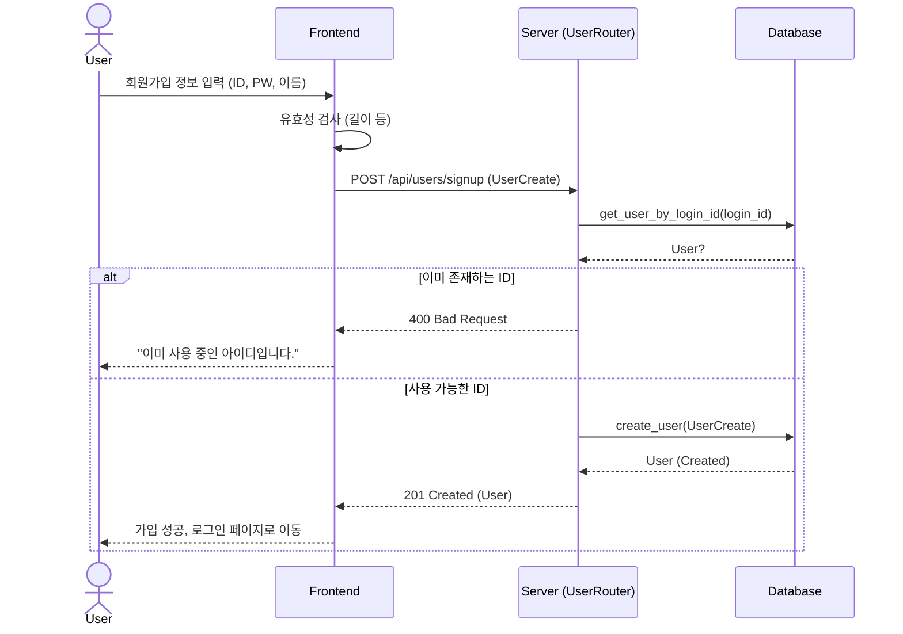

### 1.2 로그인 (Log In)
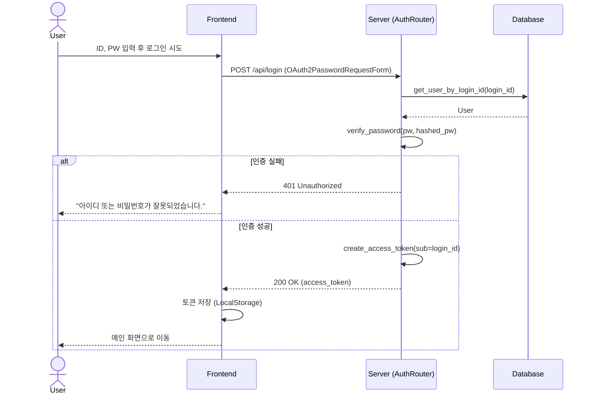

### 1.3 내 정보 조회 (Get My Info)
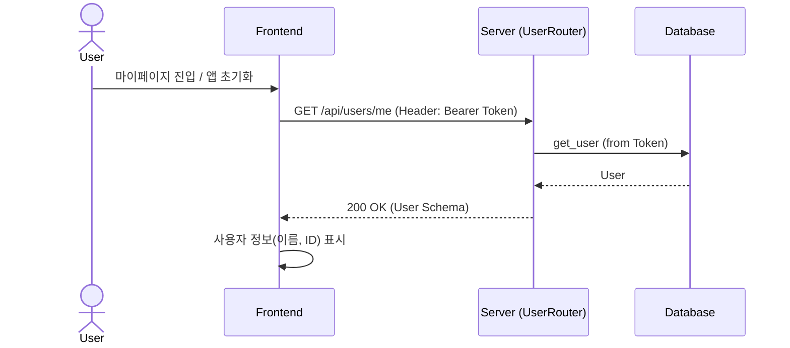

---

## 2. 채팅 (Chat Environment)

### 2.1 종목 채팅방 진입 (Enter Stock Chat / Search)
*사용자가 종목을 검색하고 해당 종목의 채팅방으로 들어가는 흐름입니다.*
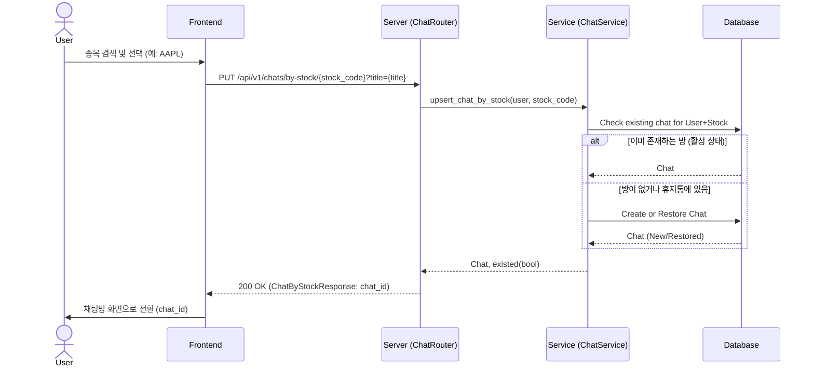

### 2.2 메시지 전송 및 AI 응답 (Send Message & AI Reply)
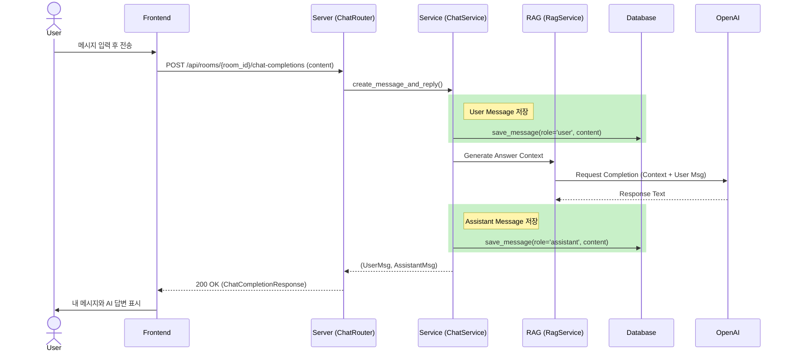

### 2.3 채팅 내역 조회 (Get Messages)
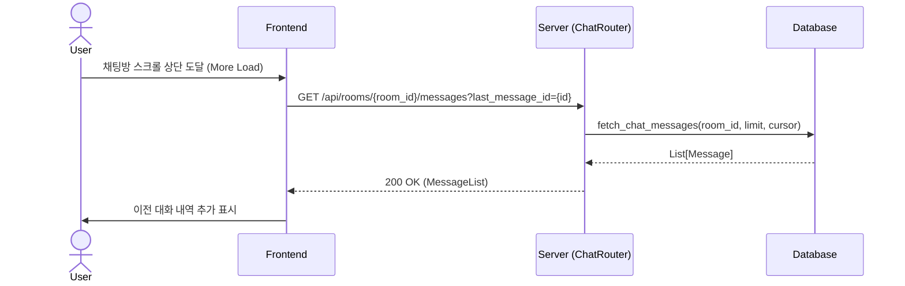

### 2.4 채팅방 목록 조회 (List Chats)
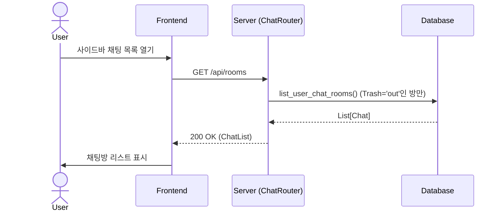

---

## 3. 사이드바 및 데이터 관리 (Sidebar & Data)

### 3.1 카테고리 관리 (Category CRUD)
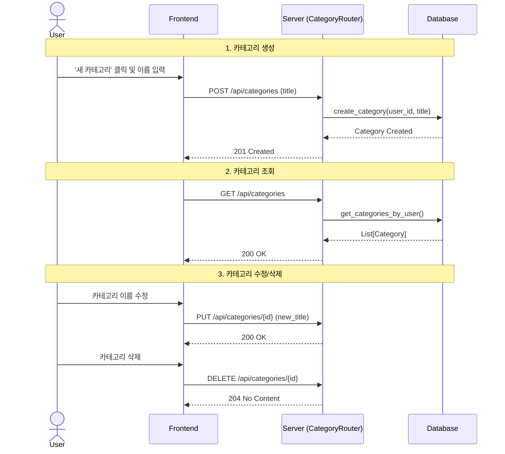

### 3.2 북마크 관리 (Bookmark CRUD)
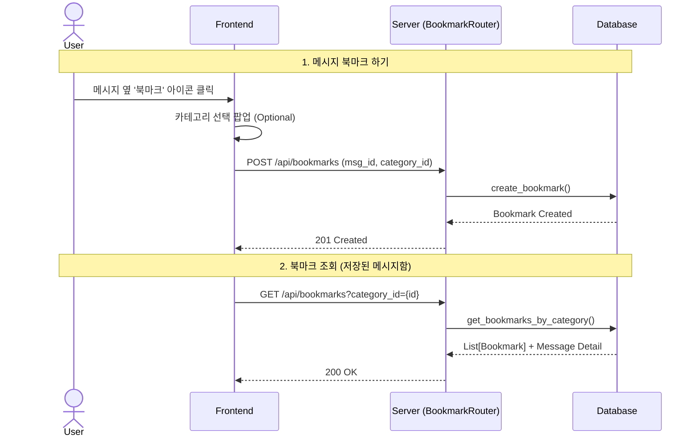

### 3.3 휴지통 관리 (Trash Management)
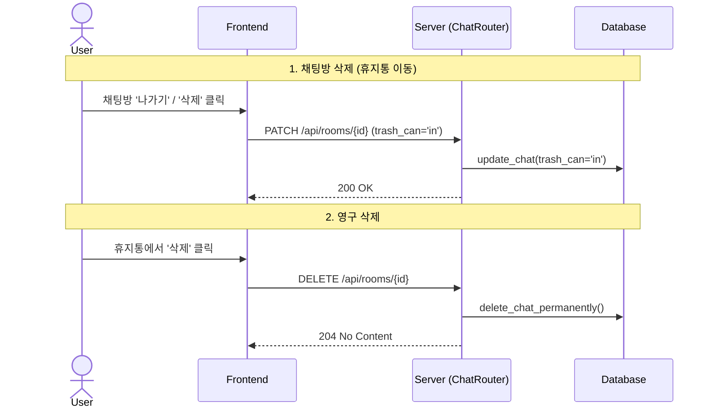

---

## 4. 커뮤니티 (Community)

### 4.1 종목 토론 댓글 작성 (Write Comment)
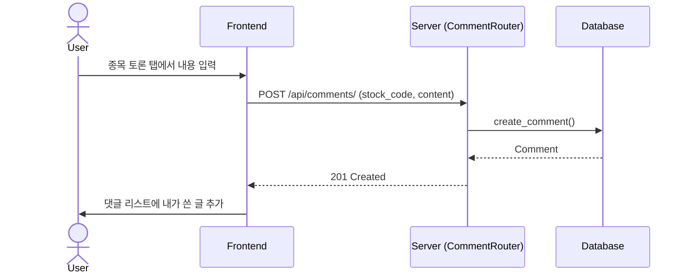

### 4.2 댓글 조회 (Read Comments)
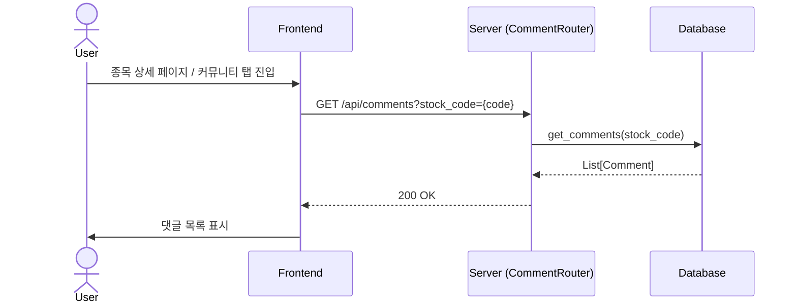

---

## 5. 시스템 및 보안 (System & Security)

### 5.1 프로필 수정 (Edit Profile)
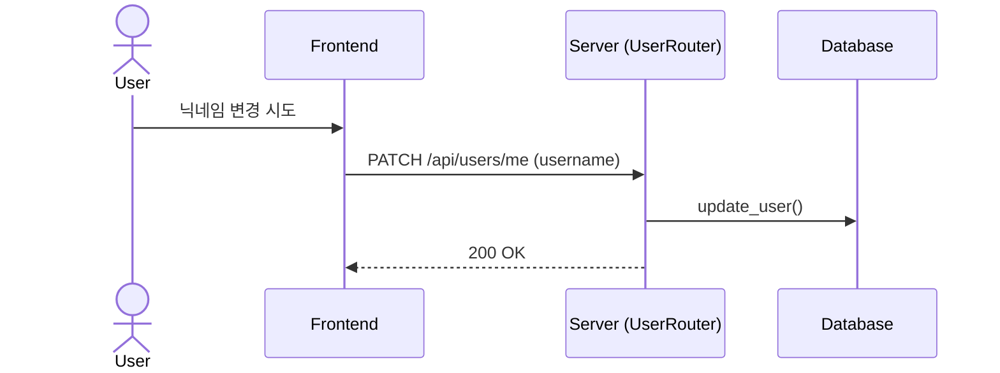

### 5.2 비밀번호 변경 (Change Password)
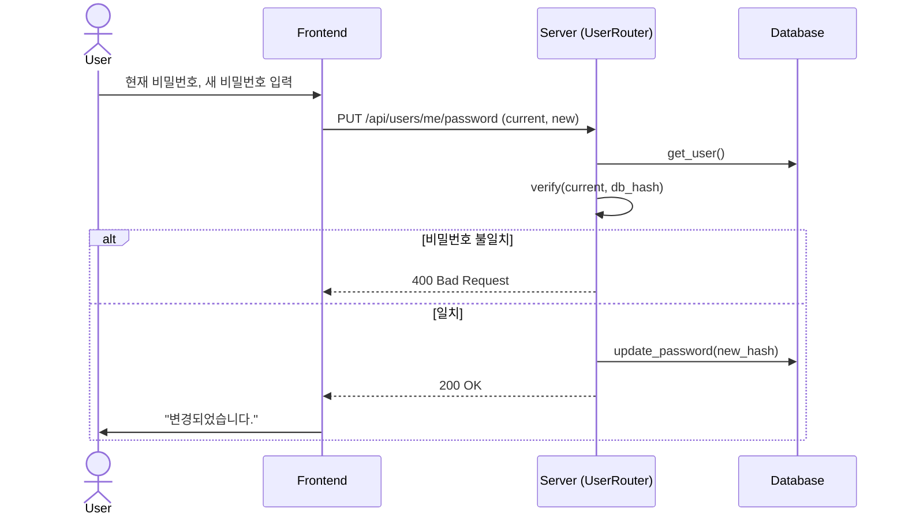
