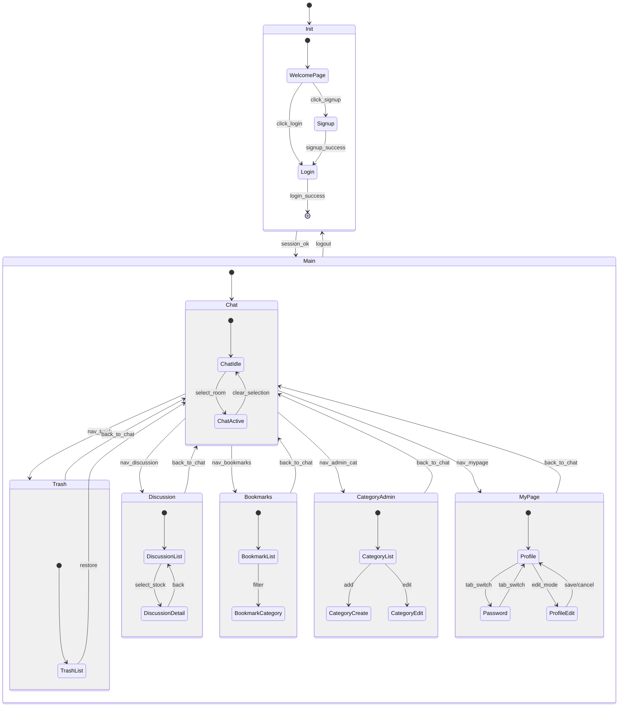

# 5. State Machine Diagram

## 5.1 어플리케이션 SMD(전면)

### 5.1.1 모델링 원칙
- **화면=State 매핑**: `App.tsx`의 라우트 정의를 기준으로 상태를 구분했습니다.
- **주요 상태**:
    - **Init**: 시작 화면 (`WelcomePage`), 로그인 (`LoginPage`), 회원가입 (`SignupPage`)
    - **Main**: 로그인 후 진입하는 주요 기능 영역 (`ChatPage` 중심)

### 5.1.2 주요 전면 상태 설명
- **Init**:
    - 앱 실행 시 `WelcomePage`가 표시됩니다.
    - 사용자는 `Login` 또는 `Signup`으로 이동할 수 있습니다.
    - 인증에 성공하면 `Main` 상태로 전이합니다.

- **Main (Composite)**:
    - **Chat (ChatPage)**: 애플리케이션의 홈 화면입니다. 좌측 사이드바를 통해 채팅방을 선택하거나 생성합니다.
    - **Discussion (StockDiscussionPage)**: 종목 토론 페이지입니다. 특정 종목에 대한 사용자들의 댓글을 확인하고 작성할 수 있습니다.
    - **Bookmarks (BookmarkPage)**: 저장된 메시지들을 확인하는 페이지입니다.
    - **Trash (TrashPage)**: 삭제된 채팅방을 복구하거나 영구 삭제하는 페이지입니다.
    - **CategoryAdmin (CategoryAdminPage)**: 북마크 카테고리를 관리하는 별도 페이지입니다.
    - **MyPage (MyPage)**: 사용자 프로필 수정 및 비밀번호 변경 기능을 제공하는 탭 구조의 페이지입니다.

### 5.1.3 내비게이션 규칙
- **사이드바/메뉴 이동**: `Chat` 화면에서 사이드바 또는 상단 메뉴를 통해 `Discussion`, `Bookmarks`, `Trash`, `MyPage` 등으로 이동할 수 있습니다.
- **뒤로가기**: 각 기능 페이지에서 작업 후 다시 `Chat` 화면으로 복귀할 수 있습니다.
- **로그아웃**: 어떤 상태에서든 로그아웃 시 세션이 종료되고 `Init` (`WelcomePage` 또는 `Login`) 상태로 돌아갑니다.

---

## 5.2 네트워크/세션 SMD(배경)

### 5.2.1 목적
UI 동작 뒤에서 일어나는 비동기 데이터 처리 흐름을 정의합니다.

### 5.2.2 공통 API 패턴
1. **Request**: UI 이벤트(버튼 클릭, 페이지 로드) 시 API 요청 발생 (Fetching).
2. **Pending**: 데이터 로딩 중 (Spinner/Loading Skeleton 표시).
3. **Success**: 응답 성공 시 UI 업데이트 (List 갱신, Detail 표시 등).
4. **Error**: 실패 시 에러 메시지 표시 (Alert 또는 Toast).

---

## 5.3 다이어그램 간 일관성
- 본 다이어그램은 `App.tsx`의 라우팅 구조와 일치합니다.
- `Chat` 상태 내부의 동작은 Class Diagram의 `ChatService` 및 Sequence Diagram의 메시지 전송 로직과 연결됩니다.
