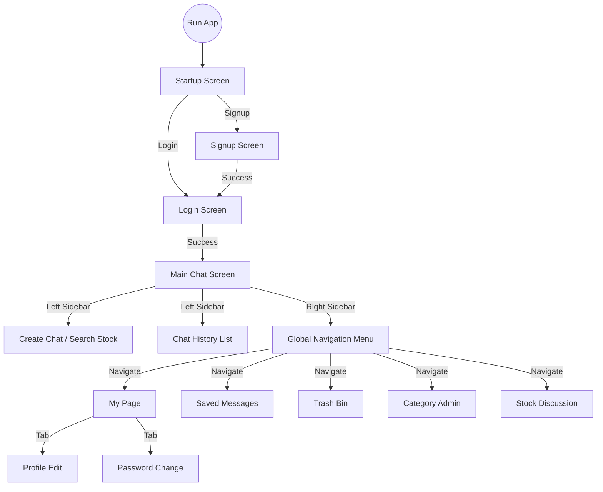

# 6. User Interface Prototype

## 6.1 화면 흐름도 (Screen Flow)

## 6.2 화면 상세 (UI Screens)

### 6.2.1 Startup Screen (WelcomePage)
- **Description**: 애플리케이션 접속 시 최초로 보여지는 화면입니다.
- **Components**:
    - **Logo**: 중앙에 위치한 서비스 로고 (AlphaBot).
    - **Login Button**: 로그인 페이지로 이동합니다.
    - **Signup Button**: 회원가입 페이지로 이동합니다.

### 6.2.2 Login Screen
- **Description**: 기존 사용자가 로그인하는 화면입니다.
- **Components**:
    - **ID Input**: 사용자 아이디 입력 필드.
    - **Password Input**: 비밀번호 입력 필드.
    - **Submit Button**: 로그인 요청을 전송합니다.
    - **Link**: 회원가입 화면으로 이동하는 링크를 제공합니다.

### 6.2.3 Signup Screen
- **Description**: 신규 사용자가 계정을 생성하는 화면입니다.
- **Components**:
    - **ID Input**: 희망 아이디.
    - **Password Input**: 비밀번호 (유효성 검사 포함).
    - **Name Input**: 사용자 별명/이름.
    - **Submit Button**: 계정 생성을 요청합니다.

### 6.2.4 Main Chat Screen (ChatPage)
- **Description**: 핵심 기능인 AI 주식 채팅이 이루어지는 메인 화면입니다.
- **Layout**:
    - **Left Sidebar**: 채팅방 목록 및 새 채팅 생성.
    - **Center (ChatArea)**: 대화 내용 표시 및 메시지 입력.
    - **Right Sidebar (RightMenu)**: 주요 기능 내비게이션 메뉴.

#### 6.2.4.1 Left Sidebar (Chat List & Creation)
- **New Chat Form**:
    - **Stock Code Input**: 관심 있는 종목 코드 입력 (예: AAPL).
    - **Title Input**: 채팅방 제목 설정 (선택 사항).
    - **Create Button**: 입력한 종목으로 새 채팅방을 생성하고 즉시 입장합니다.
- **Chat History List**:
    - 과거 생성한 채팅방 목록을 최신순으로 표시합니다.
    - 각 항목 클릭 시 해당 채팅방으로 화면이 전환됩니다.
    - 항목 우측의 '수정' 버튼으로 제목을 변경하거나 '삭제' 버튼으로 휴지통으로 이동시킬 수 있습니다.

#### 6.2.4.2 Center Area (Chat Interface)
- **Message List**:
    - **User Message**: 우측 정렬된 말풍선.
    - **AI Response**: 좌측 정렬된 말풍선. (Markdown 형식 지원).
- **Input Area**:
    - **Text Field**: 질문을 입력하는 공간입니다.
    - **Send Button**: 메시지를 전송합니다. (Enter 키 지원).
- **Welcome State**: 선택된 종목이 없을 때, 서비스 사용법을 안내하는 웰컴 메시지를 표시합니다.

#### 6.2.4.3 Right Sidebar (Global Navigation)
- **Feature Buttons**:
    - **Category**: 북마크 카테고리 관리 페이지(`CategoryAdmin`)로 이동.
    - **Trash**: 휴지통 페이지(`TrashPage`)로 이동.
    - **Saved Messages**: 저장된 메시지 목록(`BookmarkPage`)으로 이동.
    - **Stock Discussion**: 종목 토론방(`StockDiscussionPage`)으로 이동. 현재 선택된 종목이 있다면 해당 종목의 토론방으로 직행합니다.
    - **Logout**: 사용자 세션을 종료하고 로그인 화면으로 돌아갑니다.

### 6.2.5 Sub Pages

#### 6.2.5.1 My Page
- **Profile Tab**: 사용자 이름 수정 기능.
- **Password Tab**: 현재 비밀번호 확인 후 새 비밀번호로 변경 기능.

#### 6.2.5.2 Bookmarks (Saved Messages)
- **Filter**: 카테고리별로 저장된 메시지를 필터링하여 봅니다.
- **List**: 저장한 메시지의 요약 내용을 리스트로 표시합니다.

#### 6.2.5.3 Trash Bin
- **List**: 삭제한 채팅방 목록을 표시합니다.
- **Restore**: 삭제된 채팅방을 다시 활성 목록으로 복구합니다.
- **Permanent Delete**: 채팅방을 영구적으로 삭제합니다.

#### 6.2.5.4 Stock Discussion
- **Stock Selector**: 토론할 종목을 선택하거나 검색합니다.
- **Comment List**: 해당 종목에 대한 다른 사용자들의 코멘트를 최신순으로 확인합니다.
- **Input**: 자신의 의견을 작성하여 등록합니다.
