## 1. 계정관리

### 1.1 회원가입

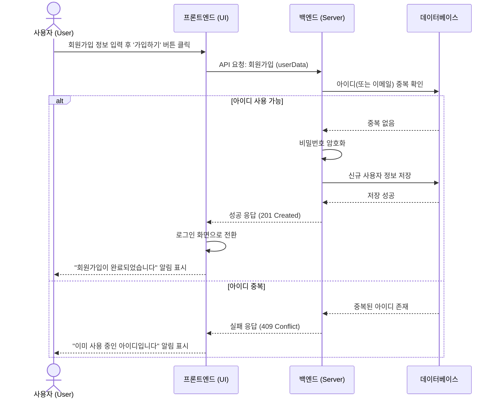
```mermaid
sequenceDiagram
    actor 사용자 as 사용자 (User)
    participant Frontend as 프론트엔드 (UI)
    participant Backend as 백엔드 (Server)
    participant DB as 데이터베이스

    사용자 ->> Frontend: 회원가입 정보 입력 후 '가입하기' 버튼 클릭
    Frontend ->> Backend: API 요청: 회원가입 (userData)
    Backend ->> DB: 아이디(또는 이메일) 중복 확인

    alt 아이디 사용 가능
        DB -->> Backend: 중복 없음
        Backend ->> Backend: 비밀번호 암호화
        Backend ->> DB: 신규 사용자 정보 저장
        DB -->> Backend: 저장 성공
        Backend -->> Frontend: 성공 응답 (201 Created)
        Frontend ->> Frontend: 로그인 화면으로 전환
        Frontend -->> 사용자: "회원가입이 완료되었습니다" 알림 표시
    else 아이디 중복
        DB -->> Backend: 중복된 아이디 존재
        Backend -->> Frontend: 실패 응답 (409 Conflict)
        Frontend -->> 사용자: "이미 사용 중인 아이디입니다" 알림 표시
    end
```

사용자가 회원가입 양식에 정보를 모두 입력하고 '가입하기' 버튼을 클릭한다 → 프론트엔드는 백엔드로 회원가입 API를 요청한다 → 백엔드는 먼저 데이터베이스에서 아이디 중복 여부를 확인한다 → (1. 가입 가능) 중복된 아이디가 없으면, 비밀번호를 암호화하여 DB에 저장하고 성공 응답을 보낸다. 프론트엔드는 로그인 화면으로 전환하며 성공 알림을 표시한다 → (2. 가입 불가) 이미 사용 중인 아이디일 경우, 백엔드가 실패 응답을 보내고 프론트엔드는 사용자에게 중복 알림을 표시한다.

### 1.2 로그인

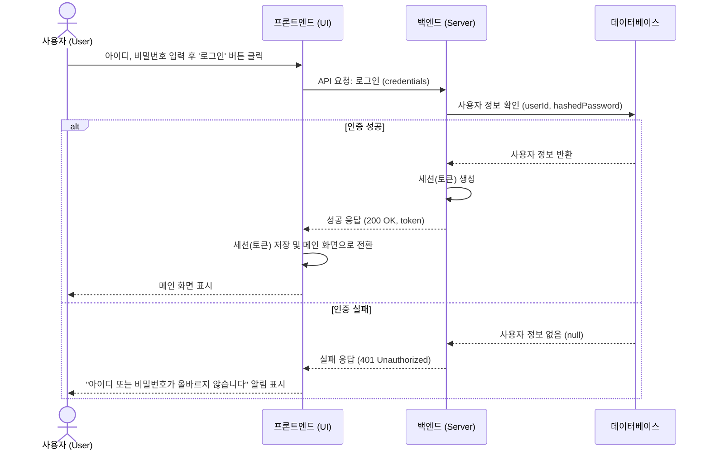
```mermaid
sequenceDiagram
    actor 사용자 as 사용자 (User)
    participant Frontend as 프론트엔드 (UI)
    participant Backend as 백엔드 (Server)
    participant DB as 데이터베이스

    사용자 ->> Frontend: 아이디, 비밀번호 입력 후 '로그인' 버튼 클릭
    Frontend ->> Backend: API 요청: 로그인 (credentials)
    Backend ->> DB: 사용자 정보 확인 (userId, hashedPassword)

    alt 인증 성공
        DB -->> Backend: 사용자 정보 반환
        Backend ->> Backend: 세션(토큰) 생성
        Backend -->> Frontend: 성공 응답 (200 OK, token)
        Frontend ->> Frontend: 세션(토큰) 저장 및 메인 화면으로 전환
        Frontend -->> 사용자: 메인 화면 표시
    else 인증 실패
        DB -->> Backend: 사용자 정보 없음 (null)
        Backend -->> Frontend: 실패 응답 (401 Unauthorized)
        Frontend -->> 사용자: "아이디 또는 비밀번호가 올바르지 않습니다" 알림 표시
    end
```

사용자가 아이디와 비밀번호를 입력하고 로그인 버튼을 클릭한다 → 프론트엔드는 백엔드로 로그인 API를 요청한다 → 백엔드는 데이터베이스에서 사용자 정보를 검증한다 → (1. 인증 성공) 백엔드는 세션(토큰)을 생성하여 프론트엔드에 전달하고, 프론트엔드는 사용자를 메인 화면으로 이동시킨다 → (2. 인증 실패) 백엔드가 실패 응답을 보내면, 프론트엔드는 사용자에게 오류 알림을 표시한다.

### 1.3 로그아웃

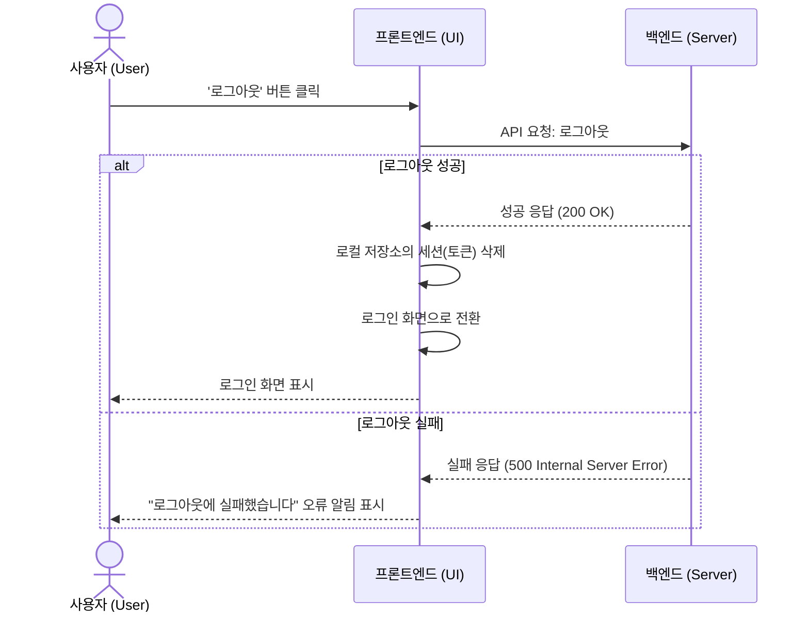
```mermaid
sequenceDiagram
    actor 사용자 as 사용자 (User)
    participant Frontend as 프론트엔드 (UI)
    participant Backend as 백엔드 (Server)

    사용자 ->> Frontend: '로그아웃' 버튼 클릭
    Frontend ->> Backend: API 요청: 로그아웃
    
    alt 로그아웃 성공
        Backend -->> Frontend: 성공 응답 (200 OK)
        Frontend ->> Frontend: 로컬 저장소의 세션(토큰) 삭제
        Frontend ->> Frontend: 로그인 화면으로 전환
        Frontend -->> 사용자: 로그인 화면 표시
    else 로그아웃 실패
        Backend -->> Frontend: 실패 응답 (500 Internal Server Error)
        Frontend -->> 사용자: "로그아웃에 실패했습니다" 오류 알림 표시
    end
```
로그인된 사용자가 '로그아웃' 버튼을 클릭한다 → 프론트엔드는 백엔드에 로그아웃 API를 요청한다 → (1. 성공 시) 백엔드가 세션을 무효화하고 성공 응답을 보내면, 프론트엔드는 로컬에 저장된 사용자 인증 정보를 삭제하고 로그인 화면으로 이동한다 → (2. 실패 시) 서버 오류 등으로 실패 응답을 받으면, 사용자에게 오류 알림을 표시한다.

## 2. 채팅

### 2.1 종목별 채팅방 입장 (Stock Chat Entry)

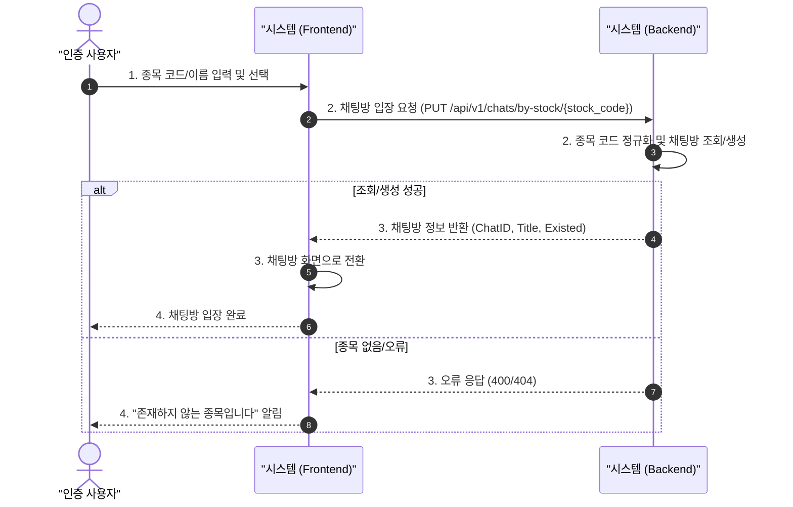
```mermaid
sequenceDiagram
    autonumber
    actor User as "인증 사용자"
    participant FE as "시스템 (Frontend)"
    participant BE as "시스템 (Backend)"

    User->>FE: 1. 종목 코드/이름 입력 및 선택
    FE->>BE: 2. 채팅방 입장 요청 (PUT /api/v1/chats/by-stock/{stock_code})
    
    BE->>BE: 2. 종목 코드 정규화 및 채팅방 조회/생성
    
    alt 조회/생성 성공
        BE-->>FE: 3. 채팅방 정보 반환 (ChatID, Title, Existed)
        FE->>FE: 3. 채팅방 화면으로 전환
        FE-->>User: 4. 채팅방 입장 완료
    else 종목 없음/오류
        BE-->>FE: 3. 오류 응답 (400/404)
        FE-->>User: 4. "존재하지 않는 종목입니다" 알림
    end
```

사용자가 종목을 선택하여 입장을 시도한다 → 프론트엔드는 백엔드에 `PUT /api/v1/chats/by-stock/{stock_code}`를 요청한다 → 백엔드는 해당 종목에 대한 사용자의 채팅방을 찾거나 새로 생성하여 반환한다 → 성공 시 해당 채팅방으로 화면을 전환한다.

### 2.2 채팅 및 질의 응답
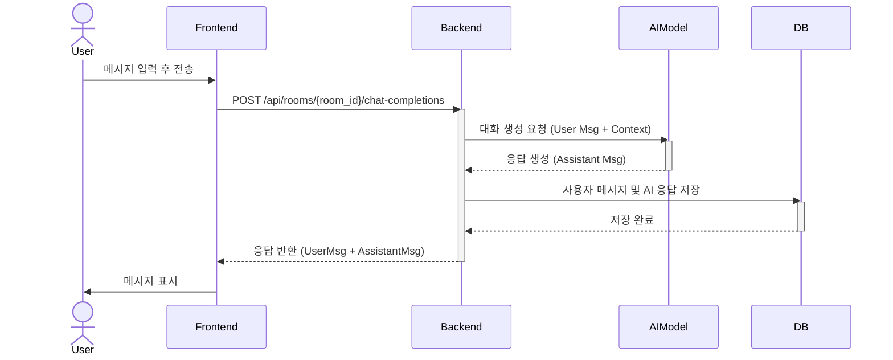
```mermaid
sequenceDiagram
    actor User
    participant Frontend
    participant Backend
    participant AIModel
    participant DB
    
    User->>Frontend: 메시지 입력 후 전송
    Frontend->>Backend: POST /api/rooms/{room_id}/chat-completions
    activate Backend
    
    Backend->>AIModel: 대화 생성 요청 (User Msg + Context)
    activate AIModel
    AIModel-->>Backend: 응답 생성 (Assistant Msg)
    deactivate AIModel
    
    Backend->>DB: 사용자 메시지 및 AI 응답 저장
    activate DB
    DB-->>Backend: 저장 완료
    deactivate DB
    
    Backend-->>Frontend: 응답 반환 (UserMsg + AssistantMsg)
    deactivate Backend
    
    Frontend->>User: 메시지 표시
```

사용자가 메시지를 입력하면 프론트엔드는 `POST /api/rooms/{room_id}/chat-completions`를 호출한다. 백엔드는 AI 모델을 통해 응답을 생성하고, 사용자와 AI의 메시지를 모두 DB에 저장한 후 반환한다.

### 2.3 채팅 메시지 저장
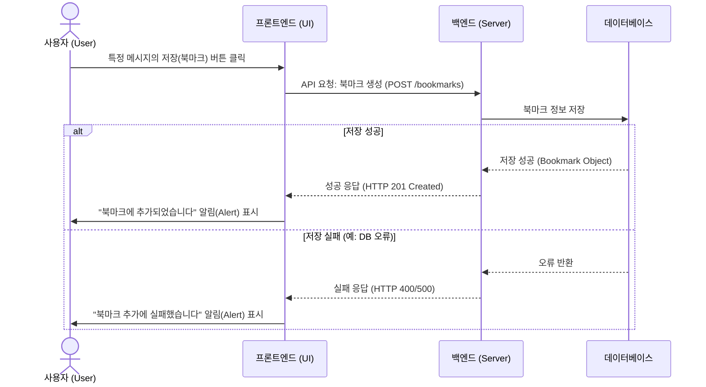
```mermaid
sequenceDiagram
    actor 사용자 as 사용자 (User)
    participant Frontend as 프론트엔드 (UI)
    participant Backend as 백엔드 (Server)
    participant DB as 데이터베이스

    사용자 ->> Frontend: 특정 메시지의 저장(북마크) 버튼 클릭
    Frontend ->> Backend: API 요청: 북마크 생성 (POST /bookmarks)

    Backend ->> DB: 북마크 정보 저장
    alt 저장 성공
        DB -->> Backend: 저장 성공 (Bookmark Object)
        Backend -->> Frontend: 성공 응답 (HTTP 201 Created)
        Frontend ->> 사용자: "북마크에 추가되었습니다" 알림(Alert) 표시
    else 저장 실패 (예: DB 오류)
        DB -->> Backend: 오류 반환
        Backend -->> Frontend: 실패 응답 (HTTP 400/500)
        Frontend ->> 사용자: "북마크 추가에 실패했습니다" 알림(Alert) 표시
    end
```

사용자가 특정 메시지의 저장(북마크) 버튼을 클릭한다. → 프론트엔드는 별도의 팝업 없이 즉시 백엔드에 북마크 생성 API를 요청한다. → (성공) 백엔드가 저장에 성공하면, 사용자에게 "북마크에 추가되었습니다" 알림을 표시한다. → (실패) DB 오류 등으로 저장이 실패하면, "북마크 추가에 실패했습니다" 오류 알림을 표시한다.

### 2.4 채팅방 삭제
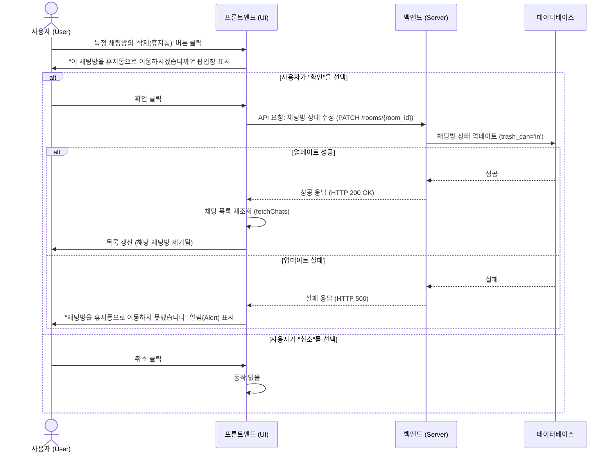
```mermaid
sequenceDiagram
    actor 사용자 as 사용자 (User)
    participant Frontend as 프론트엔드 (UI)
    participant Backend as 백엔드 (Server)
    participant DB as 데이터베이스

    사용자 ->> Frontend: 특정 채팅방의 '삭제(휴지통)' 버튼 클릭
    Frontend ->> 사용자: "이 채팅방을 휴지통으로 이동하시겠습니까?" 팝업창 표시

    alt 사용자가 "확인"을 선택
        사용자 ->> Frontend: 확인 클릭
        Frontend ->> Backend: API 요청: 채팅방 상태 수정 (PATCH /rooms/{room_id})

        Backend ->> DB: 채팅방 상태 업데이트 (trash_can='in')
        alt 업데이트 성공
            DB -->> Backend: 성공
            Backend -->> Frontend: 성공 응답 (HTTP 200 OK)
            Frontend ->> Frontend: 채팅 목록 재조회 (fetchChats)
            Frontend ->> 사용자: 목록 갱신 (해당 채팅방 제거됨)
        else 업데이트 실패
            DB -->> Backend: 실패
            Backend -->> Frontend: 실패 응답 (HTTP 500)
            Frontend ->> 사용자: "채팅방을 휴지통으로 이동하지 못했습니다" 알림(Alert) 표시
        end
    else 사용자가 "취소"를 선택
        사용자 ->> Frontend: 취소 클릭
        Frontend ->> Frontend: 동작 없음
    end
```

사용자가 특정 채팅방의 '삭제(휴지통)' 버튼을 클릭한다. → 프론트엔드가 "이 채팅방을 휴지통으로 이동하시겠습니까?"라는 팝업창을 표시한다.
→ (확인) 사용자가 확인을 선택하면, 프론트엔드는 백엔드에 채팅방 상태 수정(휴지통 이동)을 요청한다. → (성공) 업데이트 성공 시 채팅 목록을 갱신하여 해당 채팅방을 목록에서 제거한다. → (실패) 업데이트 실패하면 "채팅방을 휴지통으로 이동하지 못했습니다" 오류 알림을 표시한다.
→ (취소) 사용자가 취소를 선택하면 아무 동작도 수행하지 않는다.

## 3. 사이드바 (Sidebar)

### 3.1 카테고리 관리

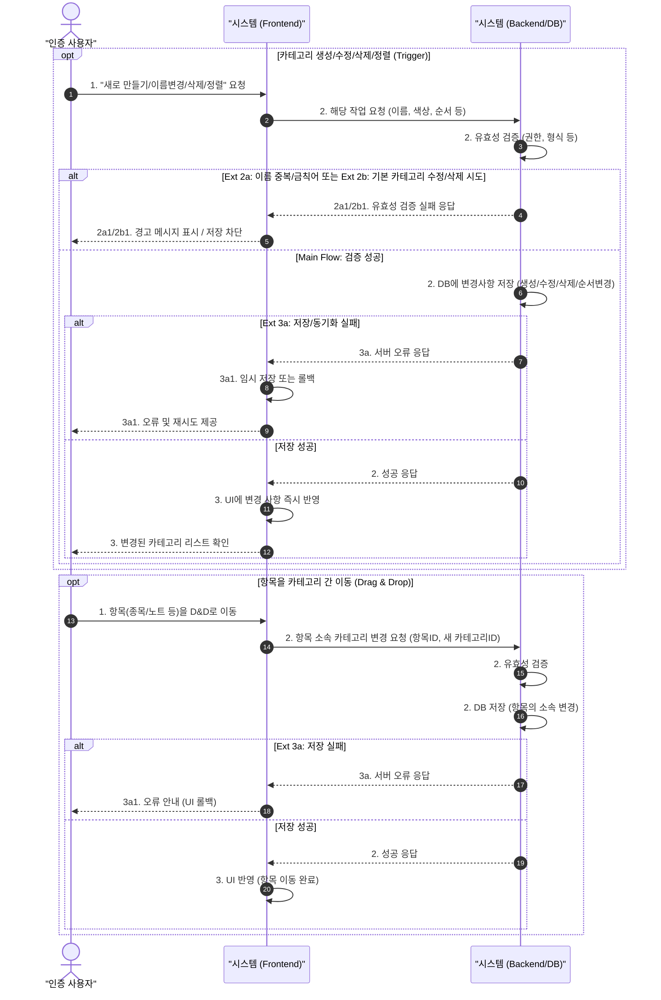
```mermaid
sequenceDiagram
    autonumber
    actor User as "인증 사용자"
    participant FE as "시스템 (Frontend)"
    participant BE as "시스템 (Backend/DB)"

    %% --- 섹션 1: 카테고리 CRUD ---
    opt 카테고리 생성/수정/삭제/정렬 (Trigger)
        User->>FE: 1. "새로 만들기/이름변경/삭제/정렬" 요청
        FE->>BE: 2. 해당 작업 요청 (이름, 색상, 순서 등)
        BE->>BE: 2. 유효성 검증 (권한, 형식 등)

        alt Ext 2a: 이름 중복/금칙어 또는 Ext 2b: 기본 카테고리 수정/삭제 시도
            BE-->>FE: 2a1/2b1. 유효성 검증 실패 응답
            FE-->>User: 2a1/2b1. 경고 메시지 표시 / 저장 차단
        else Main Flow: 검증 성공
            BE->>BE: 2. DB에 변경사항 저장 (생성/수정/삭제/순서변경)
            alt Ext 3a: 저장/동기화 실패
                BE-->>FE: 3a. 서버 오류 응답
                FE->>FE: 3a1. 임시 저장 또는 롤백
                FE-->>User: 3a1. 오류 및 재시도 제공
            else 저장 성공
                BE-->>FE: 2. 성공 응답
                FE->>FE: 3. UI에 변경 사항 즉시 반영
                FE-->>User: 3. 변경된 카테고리 리스트 확인
            end
        end
    end

    %% --- 섹션 2: 항목 Drag & Drop 이동 ---
    opt 항목을 카테고리 간 이동 (Drag & Drop)
        User->>FE: 1. 항목(종목/노트 등)을 D&D로 이동
        FE->>BE: 2. 항목 소속 카테고리 변경 요청 (항목ID, 새 카테고리ID)
        BE->>BE: 2. 유효성 검증
        BE->>BE: 2. DB 저장 (항목의 소속 변경)
        alt Ext 3a: 저장 실패
            BE-->>FE: 3a. 서버 오류 응답
            FE-->>User: 3a1. 오류 안내 (UI 롤백)
        else 저장 성공
            BE-->>FE: 2. 성공 응답
            FE->>FE: 3. UI 반영 (항목 이동 완료)
        end
    end
```

사용자가 카테고리를 생성/수정/삭제/정렬한다 → 프론트엔드는 백엔드에 해당 작업 요청을 보낸다 → (1. 이름 중복/금칙어 또는 기본 카테고리 수정/삭제 시도) 백엔드가 유효성 검증 실패 응답을 보내면, 프론트엔드는 사용자에게 경고 메시지를 표시하고 저장을 차단한다. → (2. 검증 성공) 백엔드가 유효성 검증 통과 응답을 보내면, 백엔드는 DB에 변경사항을 저장한다 → 저장 실패 시 오류 응답을 보내면, 프론트엔드는 임시 저장 또는 롤백하고 오류 및 재시도 제공한다. → (3. 저장 성공) 백엔드가 저장 성공 응답을 보내면, 백엔드는 UI에 변경 사항을 즉시 반영하고 사용자에게 변경된 카테고리 리스트를 표시한다.

### 3.2 휴지통 관리
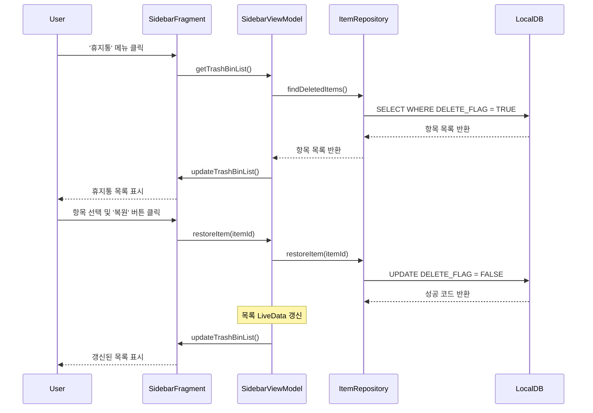
```mermaid
sequenceDiagram
    participant User
    participant SidebarFragment
    participant SidebarViewModel
    participant ItemRepository
    participant LocalDB
    User->>SidebarFragment: '휴지통' 메뉴 클릭
    SidebarFragment->>SidebarViewModel: getTrashBinList()
    SidebarViewModel->>ItemRepository: findDeletedItems()
    ItemRepository->>LocalDB: SELECT WHERE DELETE_FLAG = TRUE
    LocalDB-->>ItemRepository: 항목 목록 반환
    ItemRepository-->>SidebarViewModel: 항목 목록 반환
    SidebarViewModel->>SidebarFragment: updateTrashBinList()
    SidebarFragment-->>User: 휴지통 목록 표시
    User->>SidebarFragment: 항목 선택 및 '복원' 버튼 클릭
    SidebarFragment->>SidebarViewModel: restoreItem(itemId)
    SidebarViewModel->>ItemRepository: restoreItem(itemId)
    ItemRepository->>LocalDB: UPDATE DELETE_FLAG = FALSE
    LocalDB-->>ItemRepository: 성공 코드 반환
    Note over SidebarViewModel: 목록 LiveData 갱신
    SidebarViewModel->>SidebarFragment: updateTrashBinList()
    SidebarFragment-->>User: 갱신된 목록 표시
```

사용자가 사이드바에서 휴지통 메뉴를 클릭한다 → 삭제된 대화 기록 및 저장된 답변 목록을 확인한다 → 원하는 항목을 선택하고 복원 또는 영구 삭제 버튼을 누른다 → 목록이 갱신된다.

### 3.3 채팅기록 조회

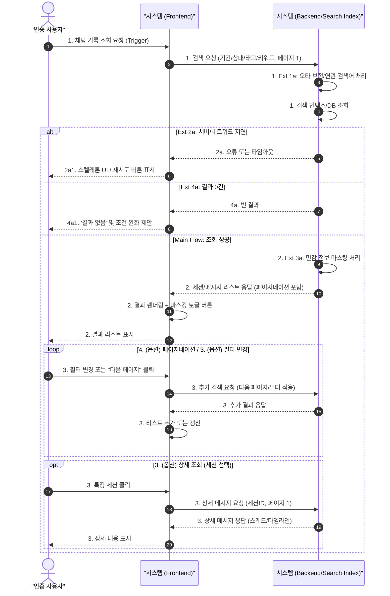
```mermaid
sequenceDiagram
    autonumber
    actor User as "인증 사용자"
    participant FE as "시스템 (Frontend)"
    participant BE as "시스템 (Backend/Search Index)"

    User->>FE: 1. 채팅 기록 조회 요청 (Trigger)
    FE->>BE: 1. 검색 요청 (기간/상대/태그/키워드, 페이지 1)
    
    BE->>BE: 1. Ext 1a: 오타 보정/연관 검색어 처리
    BE->>BE: 1. 검색 인덱스/DB 조회

    alt Ext 2a: 서버/네트워크 지연
        BE-->>FE: 2a. 오류 또는 타임아웃
        FE-->>User: 2a1. 스켈레톤 UI / 재시도 버튼 표시
    else Ext 4a: 결과 0건
        BE-->>FE: 4a. 빈 결과
        FE-->>User: 4a1. '결과 없음' 및 조건 완화 제안
    else Main Flow: 조회 성공
        BE->>BE: 2. Ext 3a: 민감 정보 마스킹 처리
        BE-->>FE: 2. 세션/메시지 리스트 응답 (페이지네이션 포함)
        FE->>FE: 2. 결과 렌더링 + 마스킹 토글 버튼
        FE-->>User: 2. 결과 리스트 표시

        loop 4. (옵션) 페이지네이션 / 3. (옵션) 필터 변경
            User->>FE: 3. 필터 변경 또는 "다음 페이지" 클릭
            FE->>BE: 3. 추가 검색 요청 (다음 페이지/필터 적용)
            BE-->>FE: 3. 추가 결과 응답
            FE->>FE: 3. 리스트 추가 또는 갱신
        end

        opt 3. (옵션) 상세 조회 (세션 선택)
            User->>FE: 3. 특정 세션 클릭
            FE->>BE: 3. 상세 메시지 요청 (세션ID, 페이지 1)
            BE-->>FE: 3. 상세 메시지 응답 (스레드/타임라인)
            FE-->>User: 3. 상세 내용 표시
        end
    end
```

사용자가 채팅 기록을 조회한다 → 프론트엔드는 백엔드에 채팅 기록 조회 요청을 보낸다 → (1. 서버/네트워크 지연) 백엔드가 오류 또는 타임아웃 응답을 보내면, 프론트엔드는 스켈레톤 UI 또는 재시도 버튼을 표시한다. → (2. 결과 0건) 백엔드가 빈 결과 응답을 보내면, 프론트엔드는 '결과 없음' 및 조건 완화 제안을 안내한다. → (3. 조회 성공) 백엔드가 세션/메시지 리스트 응답을 보내면, 프론트엔드는 결과를 렌더링하고 마스킹 토글 버튼을 제공한다.

## 4. 뉴스/공시 (News & Disclosure)

### 4.1 뉴스/공시 조회

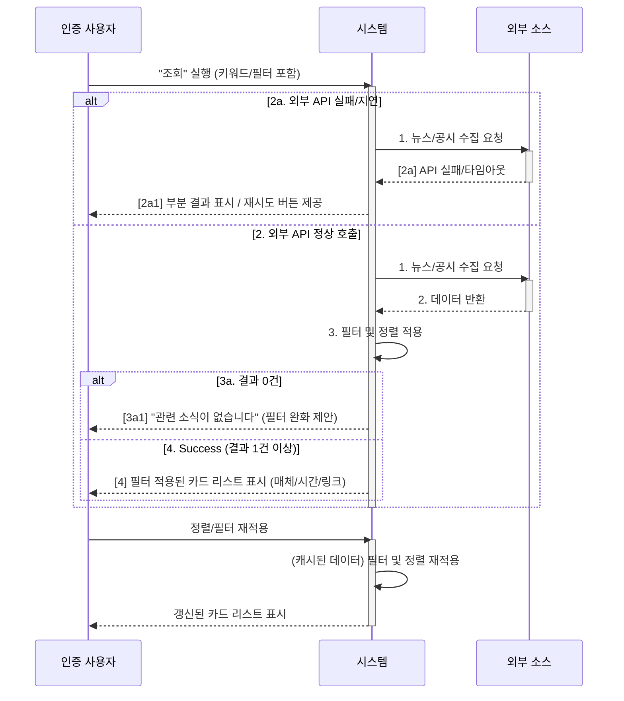
```mermaid
sequenceDiagram
    participant User as 인증 사용자
    participant System as 시스템
    participant ExternalSources as 외부 소스

    %% === 1. Main Flow: 최초 조회 ===
    User->>System: "조회" 실행 (키워드/필터 포함)
    activate System

    alt 2a. 외부 API 실패/지연
        System->>ExternalSources: 1. 뉴스/공시 수집 요청
        activate ExternalSources
        ExternalSources-->>System: [2a] API 실패/타임아웃
        deactivate ExternalSources
        System-->>User: [2a1] 부분 결과 표시 / 재시도 버튼 제공
    else 2. 외부 API 정상 호출
        System->>ExternalSources: 1. 뉴스/공시 수집 요청
        activate ExternalSources
        ExternalSources-->>System: 2. 데이터 반환
        deactivate ExternalSources

        System->>System: 3. 필터 및 정렬 적용

        alt 3a. 결과 0건
            System-->>User: [3a1] "관련 소식이 없습니다" (필터 완화 제안)
        else 4. Success (결과 1건 이상)
            System-->>User: [4] 필터 적용된 카드 리스트 표시 (매체/시간/링크)
        end
    end
    deactivate System

    %% --- 5. Post Condition: 후속 상호작용 (필터/정렬 변경) ---
    User->>System: 정렬/필터 재적용
    activate System
    System->>System: (캐시된 데이터) 필터 및 정렬 재적용
    System-->>User: 갱신된 카드 리스트 표시
    deactivate System
```

사용자가 뉴스/공시 조회를 요청한다 → 시스템은 외부 소스에서 뉴스/공시를 수집한다 → 필터와 정렬 기준을 적용한다 → 카드 리스트를 표시한다.

### 4.2 출처 및 시점 확인

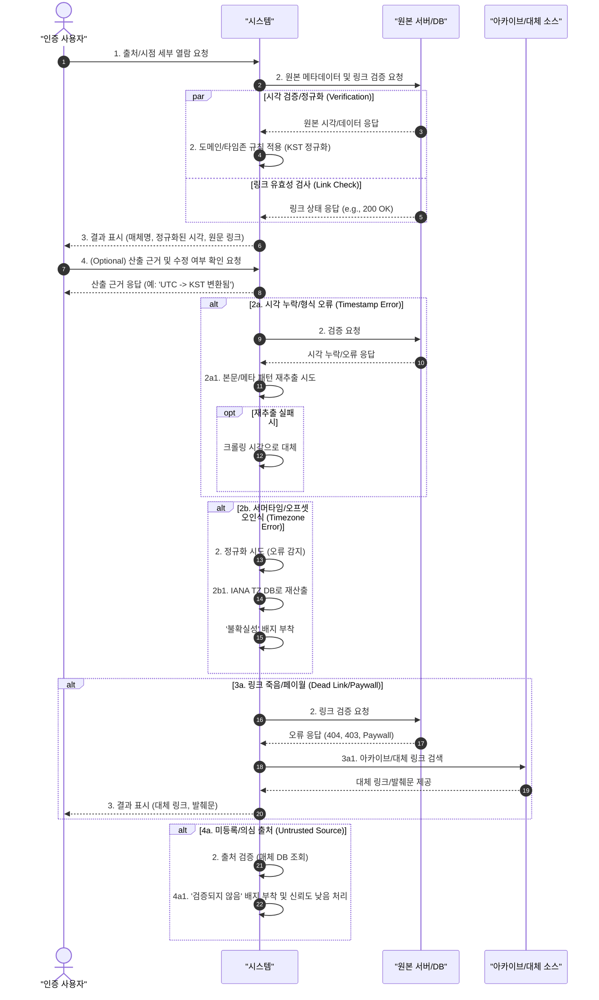
```mermaid
sequenceDiagram
    autonumber
    actor User as "인증 사용자"
    participant System as "시스템"
    participant OriginDB as "원본 서버/DB"
    participant Archive as "아카이브/대체 소스"

    %% Main Flow %%
    User->>System: 1. 출처/시점 세부 열람 요청
    System->>OriginDB: 2. 원본 메타데이터 및 링크 검증 요청
    
    par 시각 검증/정규화 (Verification)
        OriginDB-->>System: 원본 시각/데이터 응답
        System->>System: 2. 도메인/타임존 규칙 적용 (KST 정규화)
    and 링크 유효성 검사 (Link Check)
        OriginDB-->>System: 링크 상태 응답 (e.g., 200 OK)
    end

    System-->>User: 3. 결과 표시 (매체명, 정규화된 시각, 원문 링크)
    User->>System: 4. (Optional) 산출 근거 및 수정 여부 확인 요청
    System-->>User: 산출 근거 응답 (예: 'UTC -> KST 변환됨')

    %% Extensions (Alternatives) %%
    alt 2a. 시각 누락/형식 오류 (Timestamp Error)
        System->>OriginDB: 2. 검증 요청
        OriginDB-->>System: 시각 누락/오류 응답
        System->>System: 2a1. 본문/메타 패턴 재추출 시도
        opt 재추출 실패 시
            System->>System: 크롤링 시각으로 대체
        end
    end

    alt 2b. 서머타임/오프셋 오인식 (Timezone Error)
        System->>System: 2. 정규화 시도 (오류 감지)
        System->>System: 2b1. IANA TZ DB로 재산출
        System->>System: '불확실성' 배지 부착
    end

    alt 3a. 링크 죽음/페이월 (Dead Link/Paywall)
        System->>OriginDB: 2. 링크 검증 요청
        OriginDB-->>System: 오류 응답 (404, 403, Paywall)
        System->>Archive: 3a1. 아카이브/대체 링크 검색
        Archive-->>System: 대체 링크/발췌문 제공
        System-->>User: 3. 결과 표시 (대체 링크, 발췌문)
    end

    alt 4a. 미등록/의심 출처 (Untrusted Source)
        System->>System: 2. 출처 검증 (매체 DB 조회)
        System->>System: 4a1. '검증되지 않음' 배지 부착 및 신뢰도 낮음 처리
    end
```

## 5. 시스템 및 보안 (System Setting)

### 5.1 프로필 수정

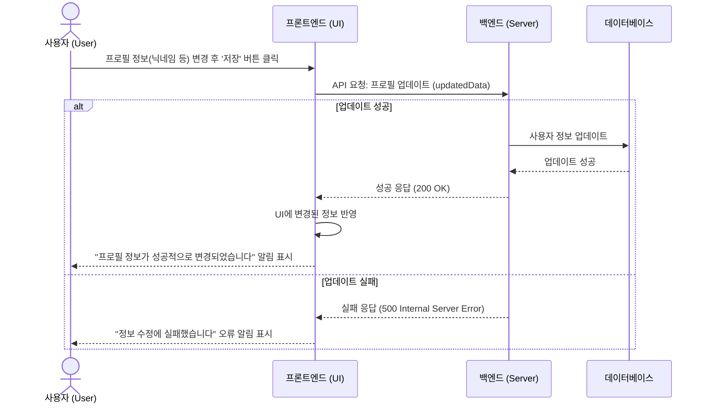
```mermaid
sequenceDiagram
    actor 사용자 as 사용자 (User)
    participant Frontend as 프론트엔드 (UI)
    participant Backend as 백엔드 (Server)
    participant DB as 데이터베이스
    
    사용자 ->> Frontend: 프로필 정보(닉네임 등) 변경 후 '저장' 버튼 클릭
    Frontend ->> Backend: API 요청: 프로필 업데이트 (updatedData)

    alt 업데이트 성공
        Backend ->> DB: 사용자 정보 업데이트
        DB -->> Backend: 업데이트 성공
        Backend -->> Frontend: 성공 응답 (200 OK)
        Frontend ->> Frontend: UI에 변경된 정보 반영
        Frontend -->> 사용자: "프로필 정보가 성공적으로 변경되었습니다" 알림 표시
    else 업데이트 실패
        Backend -->> Frontend: 실패 응답 (500 Internal Server Error)
        Frontend -->> 사용자: "정보 수정에 실패했습니다" 오류 알림 표시
    end
```

사용자가 마이페이지 등에서 자신의 프로필 정보를 수정한 후 '저장' 버튼을 클릭한다 → 프론트엔드는 변경된 정보를 백엔드에 업데이트 요청한다 → (1. 성공 시) 백엔드가 데이터베이스의 사용자 정보를 성공적으로 업데이트하면, 프론트엔드는 화면을 갱신하고 사용자에게 성공 알림을 표시한다 → (2. 실패 시) 데이터베이스 오류 등으로 실패하면, 사용자에게 오류 알림을 표시한다.

### 5.2 비밀번호 변경

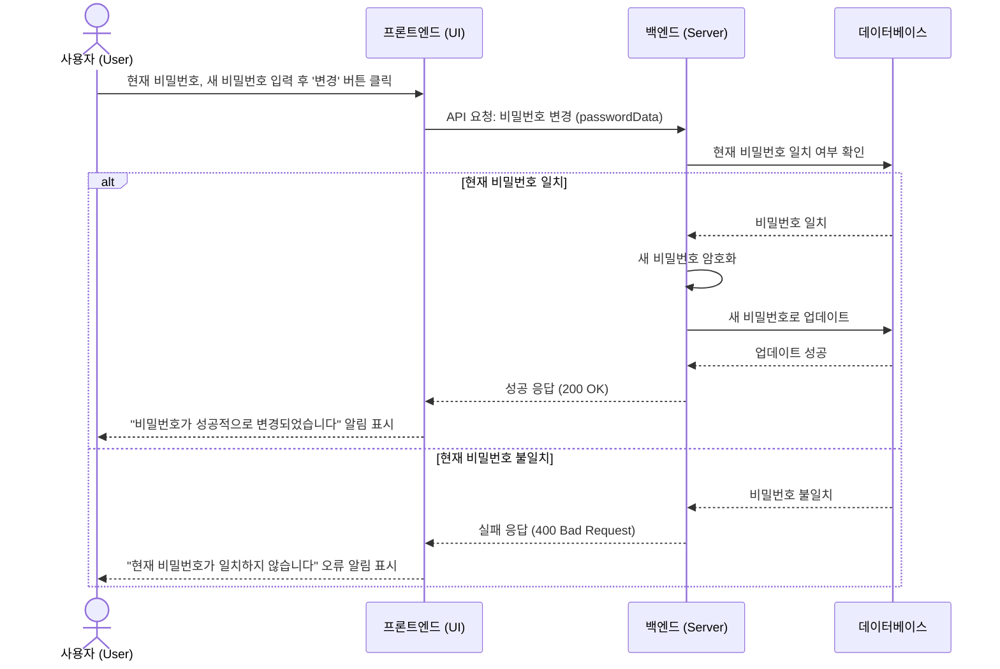
```mermaid
sequenceDiagram
    actor 사용자 as 사용자 (User)
    participant Frontend as 프론트엔드 (UI)
    participant Backend as 백엔드 (Server)
    participant DB as 데이터베이스

    사용자 ->> Frontend: 현재 비밀번호, 새 비밀번호 입력 후 '변경' 버튼 클릭
    Frontend ->> Backend: API 요청: 비밀번호 변경 (passwordData)
    Backend ->> DB: 현재 비밀번호 일치 여부 확인

    alt 현재 비밀번호 일치
        DB -->> Backend: 비밀번호 일치
        Backend ->> Backend: 새 비밀번호 암호화
        Backend ->> DB: 새 비밀번호로 업데이트
        DB -->> Backend: 업데이트 성공
        Backend -->> Frontend: 성공 응답 (200 OK)
        Frontend -->> 사용자: "비밀번호가 성공적으로 변경되었습니다" 알림 표시
    else 현재 비밀번호 불일치
        DB -->> Backend: 비밀번호 불일치
        Backend -->> Frontend: 실패 응답 (400 Bad Request)
        Frontend -->> 사용자: "현재 비밀번호가 일치하지 않습니다" 오류 알림 표시
    end
```

사용자가 현재 비밀번호와 새로 사용할 비밀번호를 입력하고 '변경' 버튼을 클릭한다 → 프론트엔드는 백엔드에 비밀번호 변경을 요청한다 → 백엔드는 먼저 데이터베이스에서 사용자가 입력한 현재 비밀번호가 올바른지 검증한다 → (1. 일치 시) 현재 비밀번호가 맞으면 새 비밀번호를 암호화하여 DB에 업데이트하고, 프론트엔드는 사용자에게 성공 알림을 표시한다 → (2. 불일치 시) 현재 비밀번호가 틀리면 백엔드가 실패 응답을 보내고, 프론트엔드는 사용자에게 오류 알림을 표시한다

## 6. 커뮤니티 (Community)

### 6.1 종목 토론 댓글 작성

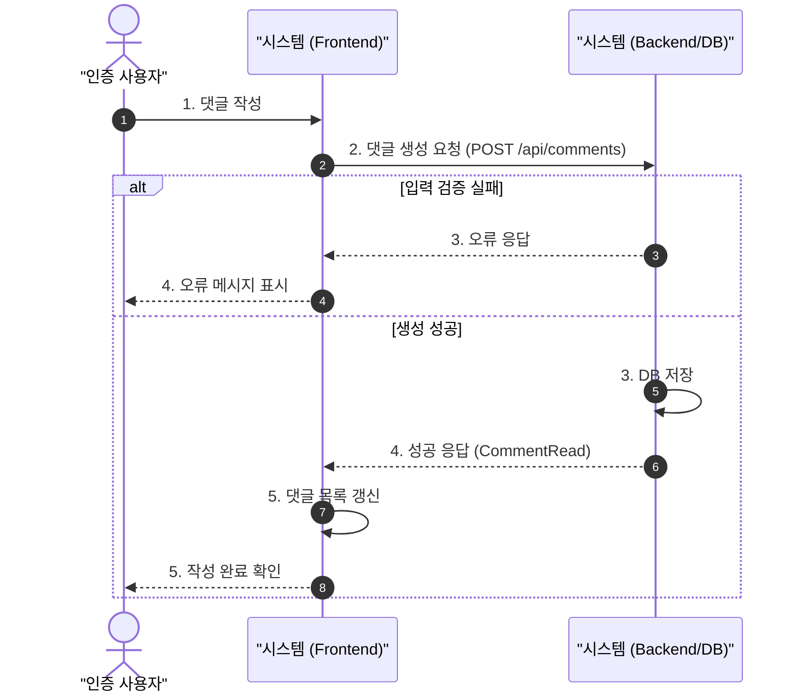
```mermaid
sequenceDiagram
    autonumber
    actor User as "인증 사용자"
    participant FE as "시스템 (Frontend)"
    participant BE as "시스템 (Backend/DB)"

    User->>FE: 1. 댓글 작성
    FE->>BE: 2. 댓글 생성 요청 (POST /api/comments)

    alt 입력 검증 실패
        BE-->>FE: 3. 오류 응답
        FE-->>User: 4. 오류 메시지 표시
    else 생성 성공
        BE->>BE: 3. DB 저장
        BE-->>FE: 4. 성공 응답 (CommentRead)
        FE->>FE: 5. 댓글 목록 갱신
        FE-->>User: 5. 작성 완료 확인
    end
```

사용자가 댓글을 작성하면 프론트엔드는 `POST /api/comments`를 호출한다.

### 6.2 종목 토론 댓글 조회

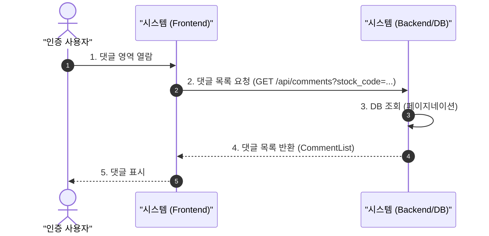
```mermaid
sequenceDiagram
    autonumber
    actor User as "인증 사용자"
    participant FE as "시스템 (Frontend)"
    participant BE as "시스템 (Backend/DB)"

    User->>FE: 1. 댓글 영역 열람
    FE->>BE: 2. 댓글 목록 요청 (GET /api/comments?stock_code=...)

    BE->>BE: 3. DB 조회 (페이지네이션)
    BE-->>FE: 4. 댓글 목록 반환 (CommentList)
    FE-->>User: 5. 댓글 표시
```

사용자가 댓글 영역을 보면 `GET /api/comments`를 통해 댓글 목록을 조회한다.
